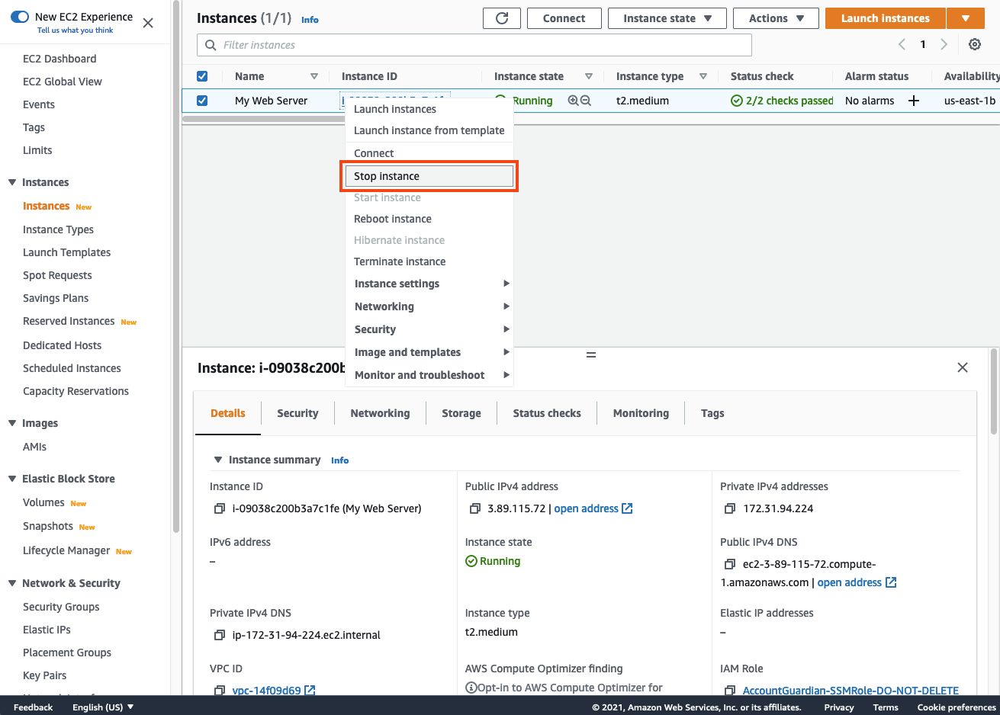
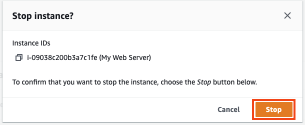
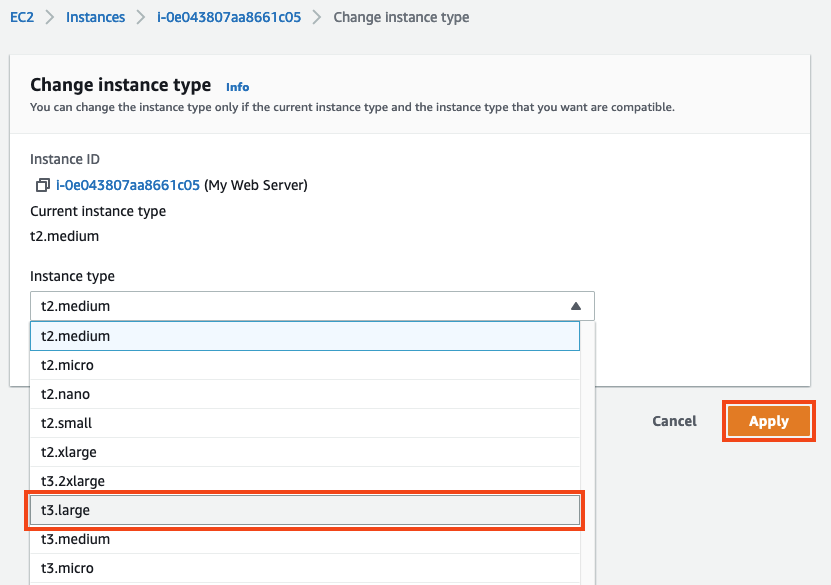
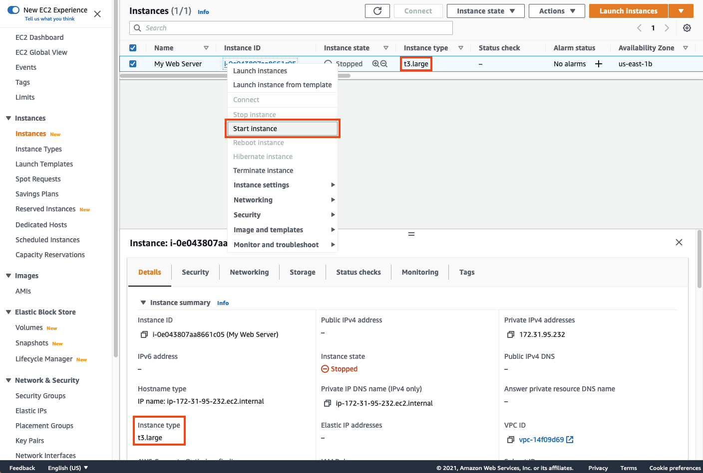

# (옵션) EC2 인스턴스 타입 변경하기

## EC2 인스턴스 타입 변경하기

AMI가 실행 중인 인스턴스 유형을 변경할 수 있다는 것을 알고 계십니까? 이것은 워크로드를 실행하기 위해 더 크거나 더 작은 유형의 인스턴스가 필요할 때 매우 유용합니다. 이 작업은 EBS 지원 인스턴스에서만 작동합니다. 본 실습에서 인스턴스 유형을 변경해야될 특별한 이유는 없지만 아래의 실습을 통해 AWS에서 인스턴스 유형을 손쉽게 변경할 수 있는 방법에 대해 알아봅니다.

1. AWS 콘솔창에서 실습에서 생성한 인스턴스를 우클릭하고 Stop instance를 클릭합니다(Terminate 인스턴스와 혼동하지 마세요).

1. Stop 버튼을 클릭합니다.

1. 인스턴스가 stopped되면 다시 우클릭을하여 Instance settings에서 Change instance type를 클릭합니다.

1. Change instance type 창에서 t3.large 인스턴스 타입을 선택하고 Apply 버튼을 클릭합니다.

1. 인스턴스를 선택하고 우클릭 후, Start instance를 선택합니다.

잘하셨습니다 EC2 인스턴스 타입을 성공적으로 변경하였습니다.

[Previous](3-ec2.md) | [Next](5-ec2.md)
