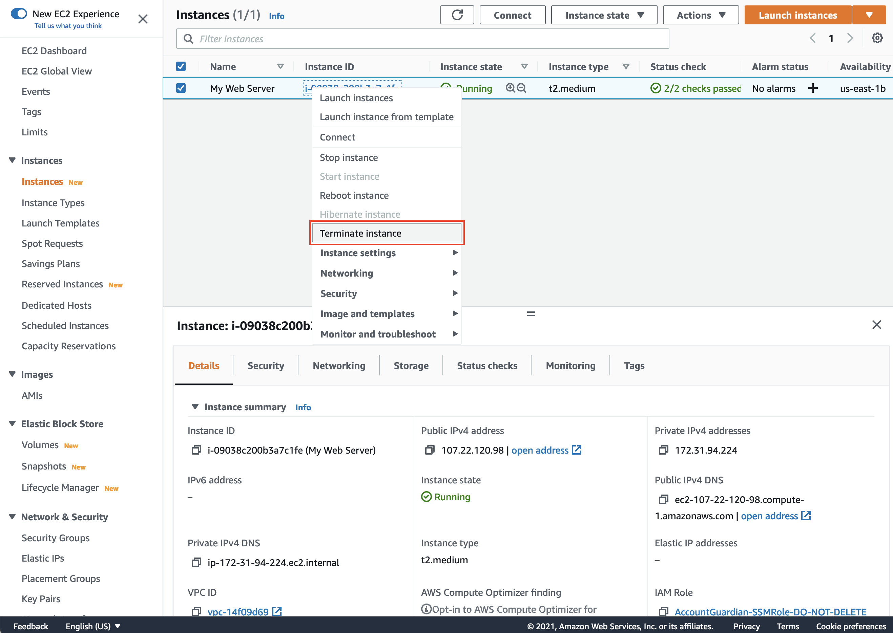
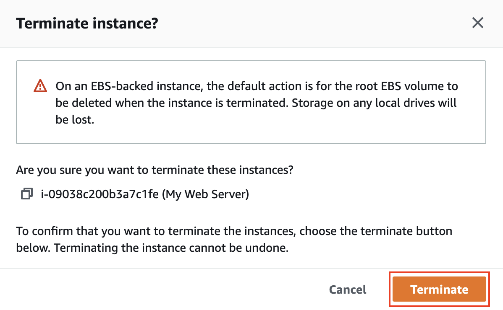

# 실습 자원 삭제하기

## 자원 정리

1. 생성한 EC2 인스턴스를 종료하기 위해, 본 실습에서 생성한 인스턴스를 선택합니다. Instance state 메뉴에서 Terminate instance를 선택합니다.

1. 종료하고자 하는 인스턴스가 맞는지 확인한 후, Terminate 버튼을 클릭합니다.

[Previous](5-ec2.md) | [Next](../../ec2-auto-scaling/)
