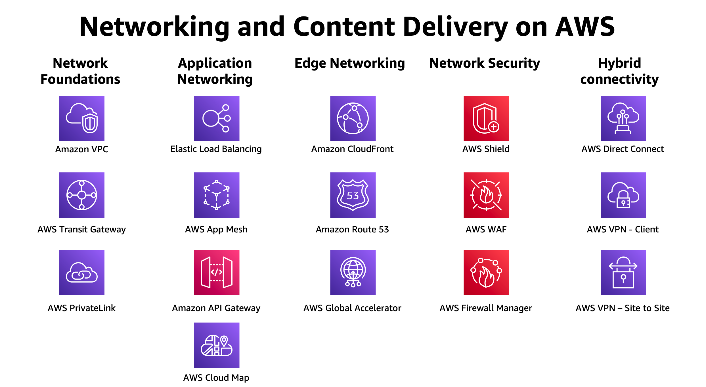

# 네트워크 - Amazon VPC

AWS는 전 세계에서 가장 높은 수준의 안정성, 가장 많은 보안 기능 및 최고의 성능을 갖춘 가장 방대하고 세분화된 네트워킹 서비스 세트를 제공합니다. 이러한 네트워킹 서비스를 활용하면 클라우드에서 모든 종류의 워크로드를 실행할 수 있습니다.

AWS 네트워크 서비스 는 아래와 같은 특징을 가지고 있습니다:

* 가장 뛰어난 보안
* 최고의 네트워크 가용성
* 일관된 고성능
* 가장 광범위한 글로벌 서비스 지원

[Previous](../10-ec2/10-ec2/ec2-auto-scaling/ec2-auto-scaling/6-ec2-as.md) | [Next](../../20-vpc/vpc.md)
