# 첫 번째 API 만들기

1. Sign into the AWS Management Console and open Amzon API Gateway console at https://console.aws.amazon.com/apigateway
2. If this is your first API, you will see the Amazon API Gateway welcome page.

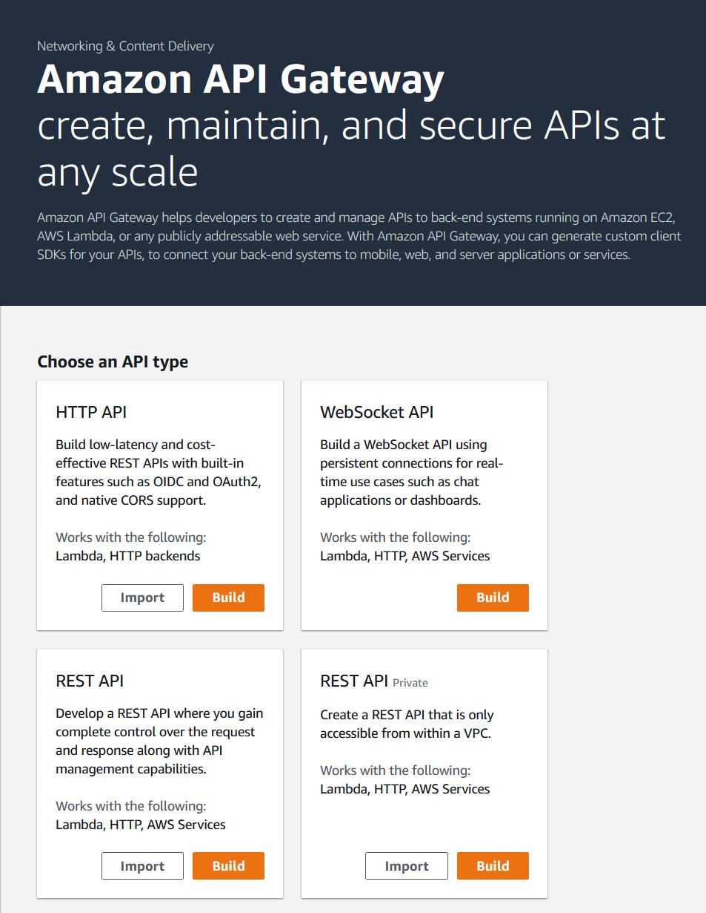

* Click on Build under REST API. Click Ok on the popup

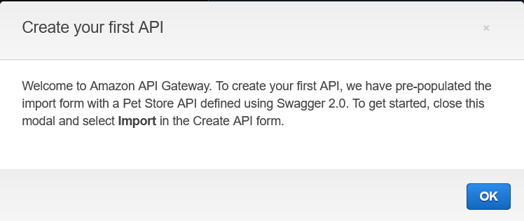

* Otherwise, click APIs then Create API. - Click on Build under REST API.

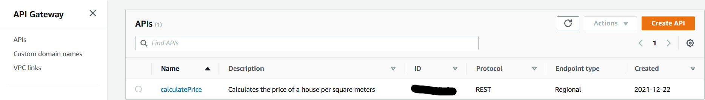

1. Under Create New API Select New API
2. Under Settings, Enter the following values:
   * API Name: calculatePrice
   * Description: Calculates the price of a house per square meters
   * Endpoint Type: Regional

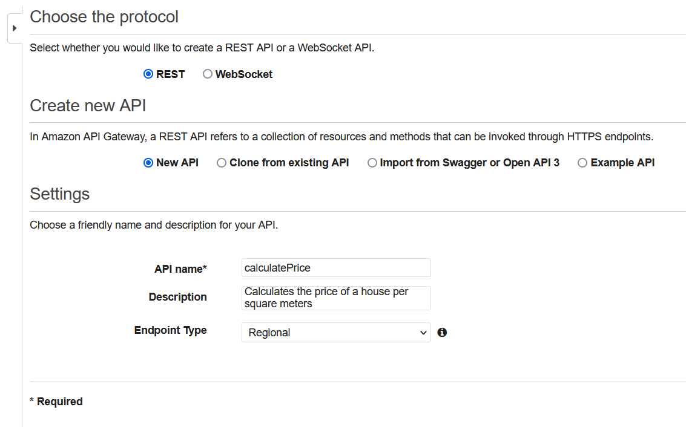

1. Click Create API
2. Under Actions, choose Create Resource

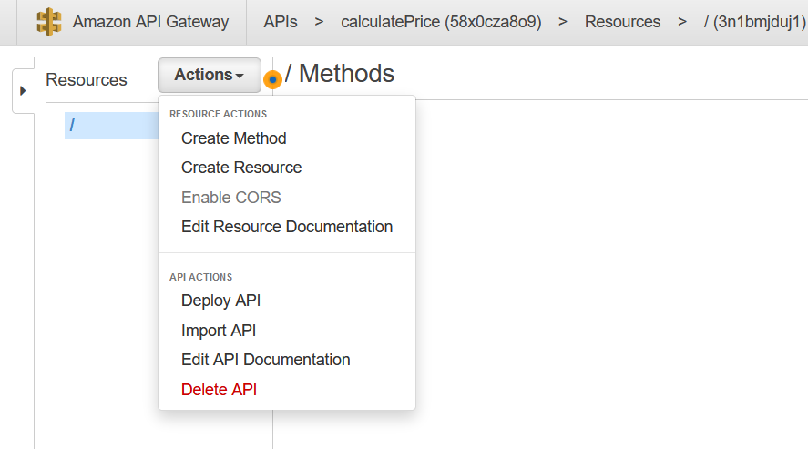

1. Enter the following values:
   * Resource Name: pricePerMeter
2. Click Create Resource

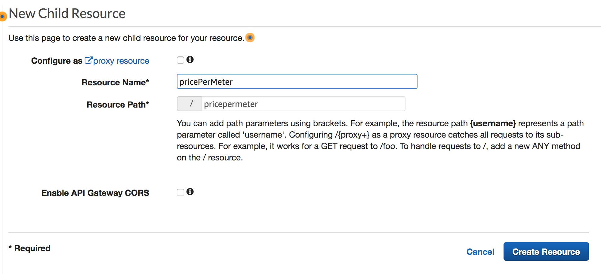

1. Select Actions, choose Create Method

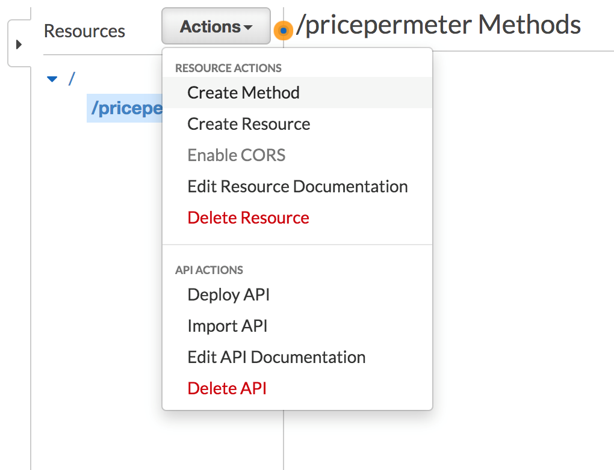

1. Choose Post and Click on check icon to confirm.

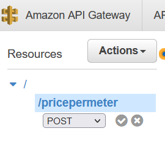

1. Under the Post method, Choose the following values:
   * Integration Type: Lambda Function
   * Lambda Region: us-east-1
   * Lambda Function: serverless-immersion-day-stac-CalculateCostPerUnit- (Select the function which comes up.)
2. Click Save.

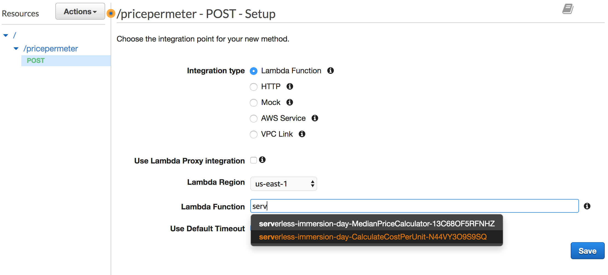

1. In the dialogue box, Add Permission to Lambda Function, Click OK.

You have now configured your API to call the costCalculator lambda function. The API Gateway pane shows the request and response flow of data.

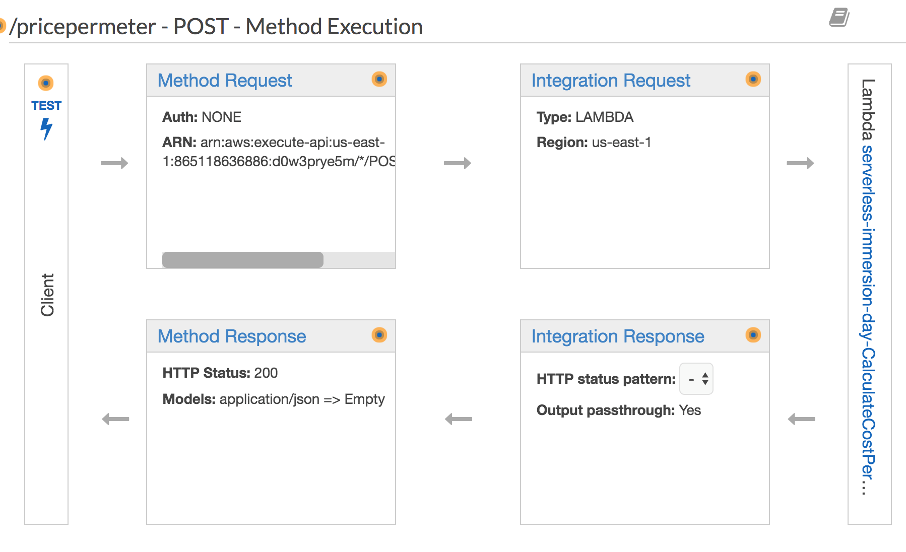

1. Click on the Test icon to provide a sample request message.
2. Copy and Paste the following JSON Sample in the Request Body section

```
{
  "price": "400000",
  "size": "1600",
  "unit": "sqFt",
  "downPayment": "20"
} 
```

1. Click Test

Please note the Response Body with a status code of 200. The body of the response contains the price per unit and the total cost. The header of the response along with the message body is composed by the lambda function. The testing page also shows a complete request/response log.

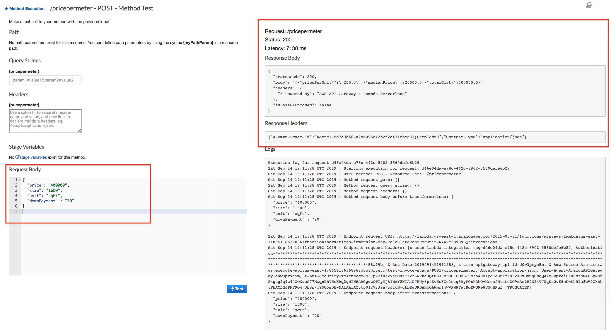

Notice that the lambda service returned the total cost, but did not account for the down payment. In the next section, we will transform the message to pass the down payment amount to the lambda function.

[Previous](1-apigateway.md) | [Next](3-apigateway.md)
