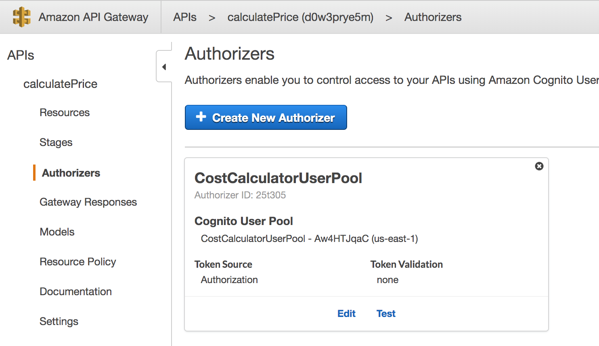
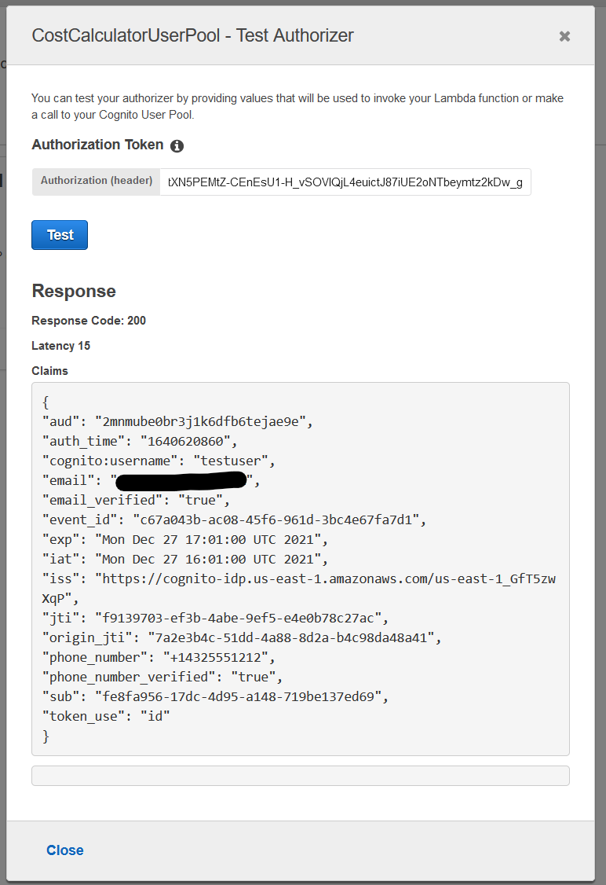

# 인증 및 권한 부여

At this point, our API is wide open and we need to protect it by implementing an authentication mechanism. API Gateway supports IAM auth, Cognito User Pools, and custom authorizers written as Lambda function. In this lab, we will leverage Amazon Cognito to have only registered users use our costCalculator API.

Below are the steps to enable authentication and authorization to the API:

* Create Cognito User Pool
* Create a User
* Login as user
* Update API Gateway Authentication

## Create Cognito User Pool

The first step is to create a Cognito User Pool. A User Pool is our user directory. We can register users in the pool and users can authenticate with their credentials. The outcome of a successful authentication against User Pools is an Open ID Connect-compatible (OIDC) identity token and a JWT access token

1. From the services menu, choose Security, Identity, & Compliance then Cognito or go to https://console.aws.amazon.com/cognito
2. Click on Manage User Pools
3. Click on Create a user pool
4. Enter CostCalculatorUserPool


1. Click Step through Settings
2. Click on the App clients menu from the left navigation pane
3. Click Add an app client
4. Enter Cost-Calculator-App-Client for the name
5. Uncheck Generate client secret
6. Check Enable username password auth for admin APIs for authentication (ALLOW\_ADMIN\_USER\_PASSWORD\_AUTH)
7. Leave all other default fields and click Create app client


1. Click on the Review item from the navigation pane
2. Leave all the default fields and click Create Pool


In the user pool screen, make a note of your Pool Id


1. Click on App client settings

Make a note of your App Client ID


## Create a User

The next step is to create users that will be allowed to call our CostCalculatorAPI. From the CostCalculatorUserPool, perform the following:

1. Click on Users and groups from the left navigation pane of CostCalulatorUserPool
2. Click Create User
3. Enter the following values:
   * UserName: testUser
   * Send an invitation to new user? Uncheck
   * Temporary password: testUser123!
   * Phone Number: +14325551212
   * Mark phone number as verified? Check
   * Email: enter your e-mail address
   * Mark email as verified? Check


1. Click Create User

## Login as user

Now that the user pool is configured, open up a terminal and use AWS CLI to simulate a login for the user.

1. Enter the following command. Replace the user-pool-id, client-id attributes:

> aws cognito-idp admin-initiate-auth --user-pool-id \<YOUR\_POOL\_ID> --client-id \<YOUR\_CLIENT\_ID> --auth-flow ADMIN\_NO\_SRP\_AUTH --auth-parameters 'USERNAME=testUser,PASSWORD="testUser123!"'

1. The first response to this request should be an authentication challenge, the user pool reminds you that you need to change the password for the user. If you recall, when we created the user it asked us for a temporary password, not the final one

```
{
  "ChallengeName": "NEW_PASSWORD_REQUIRED", 
  "Session": "...",
  "ChallengeParameters": {
    "USER_ID_FOR_SRP": "testUser", 
    "requiredAttributes": "[]", 
    "userAttributes": "{\"email_verified\":\"true\",\"phone_number_verified\":\"true\",\"phone_number\":\"+14325551212\",\"email\":\"user@eMail\"}"
  }
}
```

Make note of the Session value from the response above.

1. Use the CLI to set the final password for the user. Replace the pool ID, client ID, username/pwd and the session attributes. The session value can be retrieved from the response to step 2. Ensure your final passwords contains lower case, upper case, number and character symbols.

> aws cognito-idp admin-respond-to-auth-challenge --user-pool-id \<YOUR\_POOL\_ID> --client-id \<YOUR\_CLIENT\_ID> --challenge-name NEW\_PASSWORD\_REQUIRED --challenge-response "USERNAME=testUser,NEW\_PASSWORD=\<FINAL\_PASSWORD>" --session "\<SESSION\_VALUE\_FROM\_PREVIOUS\_RESPONSE>"

You may get an invalid session response if run the above command more than a minute or so after the command in step 2.

> An error occurred (NotAuthorizedException) when calling the AdminRespondToAuthChallenge operation: Invalid session for the user, session is expired.

If you do run the command from step 2 again, copy the new Session value and rerun the command in step 3.

1. The output from this call should be a valid session

```
{
  "ChallengeParameters": {},
  "AuthenticationResult": {
      "AccessToken": "...",
      "ExpiresIn": 3600, 
      "TokenType": "Bearer", 
      "RefreshToken": "...", 
      "IdToken": "..."
  }
}
```

The response contains three important parameters. The IdToken is the Open ID Connect-compatible identity token that API Gateway uses to authenticate calls - this is the token we will pass to the APIs in the Authorization header. The AccessToken is a JWT token that contains the user scopes and identity pool information. The last property is a RefreshToken, you can use this token with the User Pool APIs to fetch a new identity and access token.

## Update API Gateway Authentication

1. Go back to API Gateway Service or go to https://console.aws.amazon.com/apigateway
2. Click on calculatePrice API
3. Click Authorizers on the navigation menu
4. Click Create new authorizer
5. Enter the following values:
   * Name: CostCalculatorUserPool
   * Type: Cognito
   * Cognito Region: us-east-1 (or your region)
   * Cognito user Pool: CostCalculatorUserPool
   * Token source: method.request.header.Authorization
   * Token validation:


1. Click Create



1. Test your Authorizer by placing the returned IdToken from above and click TEST

If needed, you get a new token for a user by using the following AWS CLI command:

> aws cognito-idp admin-initiate-auth --user-pool-id \<YOUR\_POOL\_ID> --client-id \<YOUR\_CLIENT\_ID> --auth-flow ADMIN\_NO\_SRP\_AUTH --auth-parameters 'USERNAME=testUser,PASSWORD="\<FINAL\_PASSWORD>"'



Go back to the calculatePrice API and click on the POST action. Set the Method Request Authorization for the API.

1. From the API Gateway Console, click on Method Request


1. Click the pencil icon next to Authorization then select CostCalculatorUserPool

Reload the page if CostCalculatorUserPool doesn’t show up in the Authorization list.


1. Click the check mark icon to confirm the Authorization.

The authorization will be tested on the API in the next section.

[Previous](4-apigateway.md) | [Next](6-apigateway.md)
