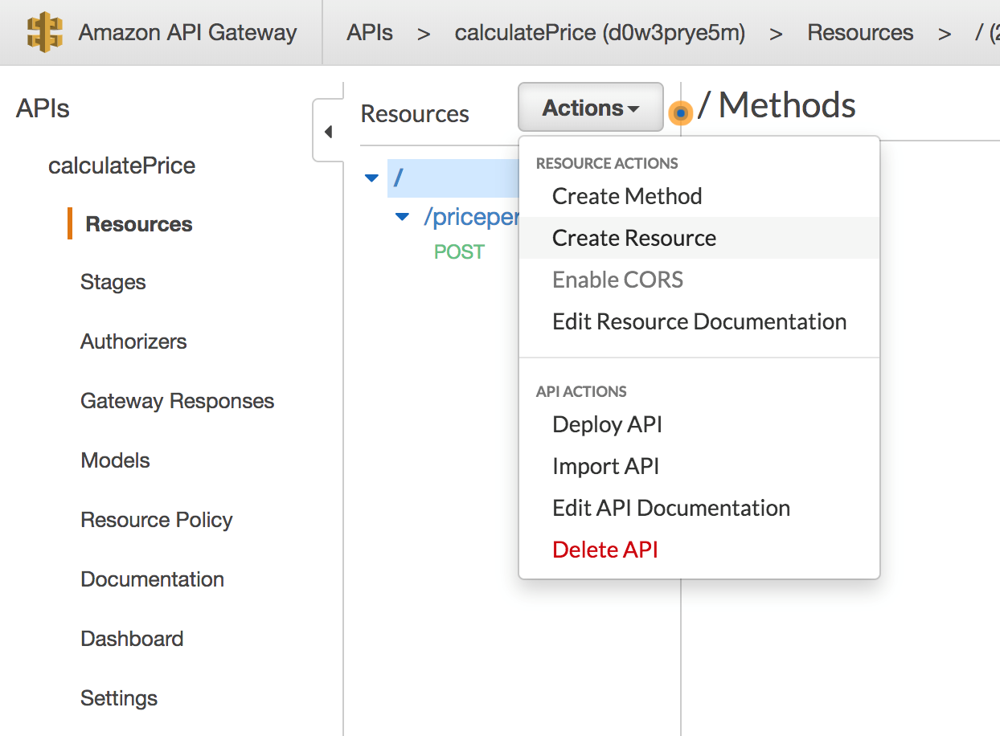
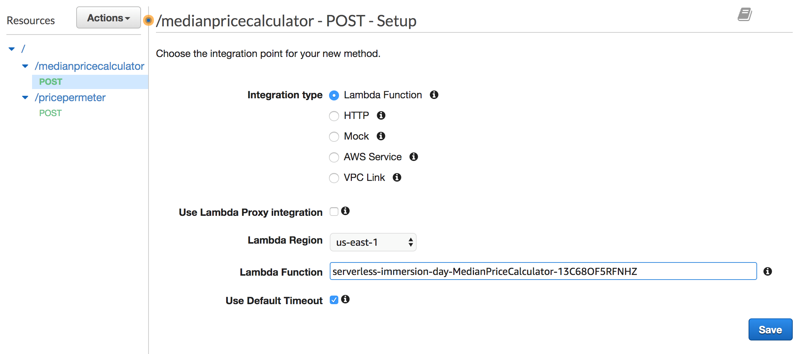
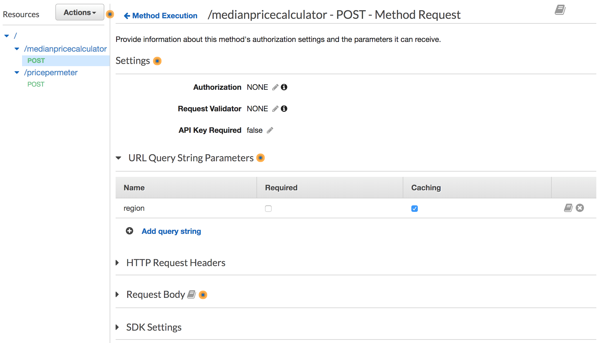
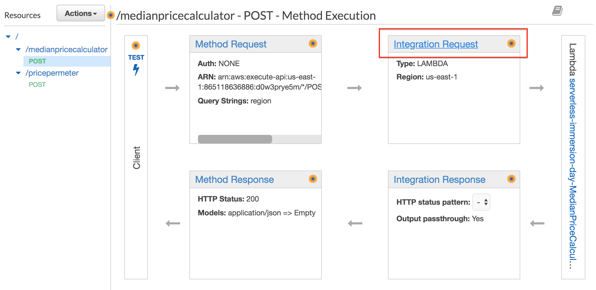
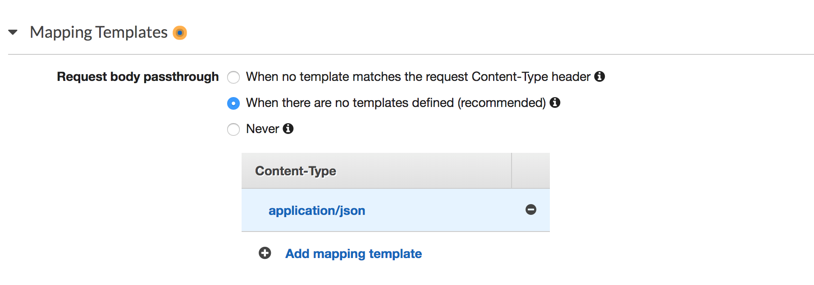
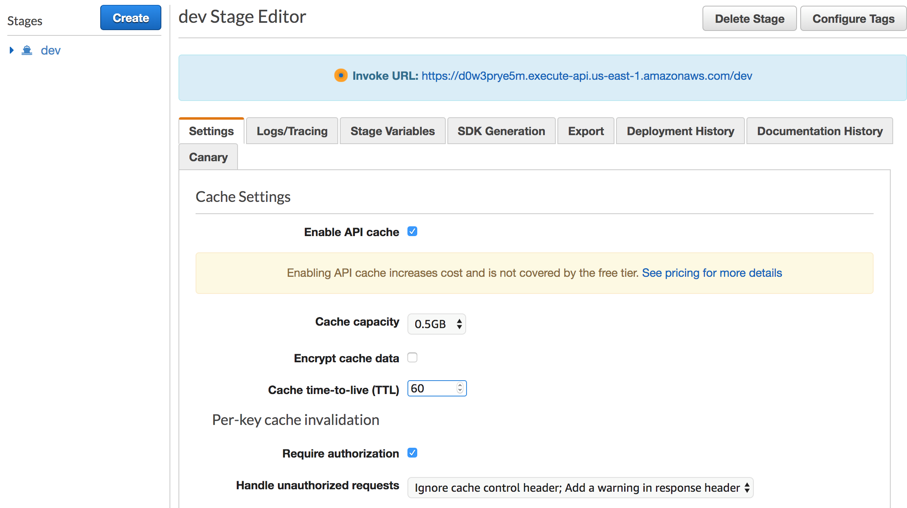
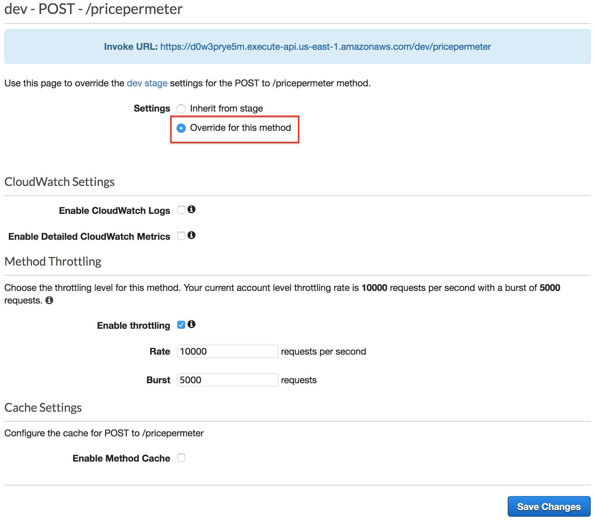
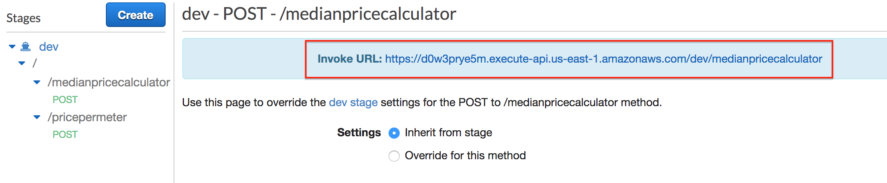
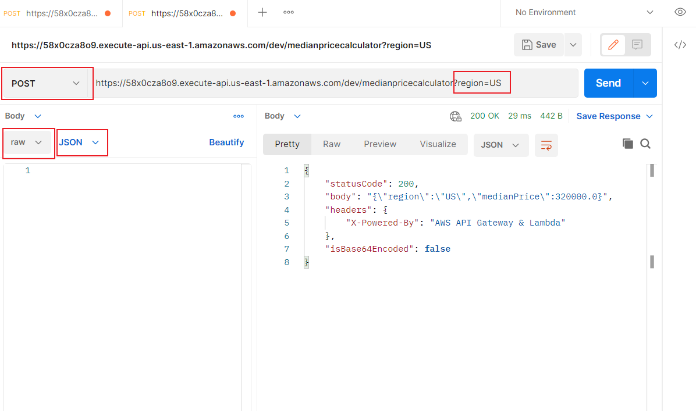

# 메시지 캐싱(선택 사항)

You can enable API caching in Amazon API Gateway to cache your endpoint's response. With caching, you can reduce the number of calls made to your endpoint and also improve the latency of the requests to your API. When you enable caching for a stage, API Gateway caches responses from your endpoint for a specified time-to-live (TTL) period, in seconds. API Gateway then responds to the request by looking up the endpoint response from the cache instead of making a request to your endpoint.

API Gateway enables caching at the stage or method level. In this lab, we will create a new resource called medianPriceCalculator. This service returns the median price of houses in US or Canada. Since these regional prices do not change often, we can cache the results.

* Create a new resource
* Enable Caching
* Deploy the API
* Testing Your Cached Resource

## Create a new resource

1. From API Gateway Console, select the root element of calculatePrice API
2. Click Actions, then choose Create Resource



1. Enter the following values
   * Resource Name: medianPriceCalculator
2. Click Create Resource
3. Click on Actions, then Choose "Create Method".
4. Choose POST and select check mark.
5. For the Post Setup, choose the following values:
   * Integration Type: Lambda Function
   * Lambda Region: us-east-1 (or your chosen region)
   * Lambda Function: serverless-immersion-day-sta-MedianPriceCalculator- (Select the function which comes up.)



1. Click Save, then Ok on the popup.

## Enable Caching

Now that the API is created, we can enable caching at the method level. Since the median price for Canada and US are different, it would make sense to cache based on the chosen region. When a cached method or integration has parameters, which can take the form of custom headers, URL paths, or query strings, you can use some or all of the parameters to form cache keys. API Gateway can cache the method's responses, depending on the parameter values used.

In this example, we will create a query parameter to cache the results based on the region attribute. The region can take a value of US or CA, United States or Canada respectively.

1. Click the POST method of the medianpriceCalculator API.
2. From the API Console, click on Method Request
3. Expand the URL Query String Parameters.
4. Click Add query String
5. Enter region for the name
6. Click on check mark icon
7. Check Caching



Now that we are passing the region as a query parameter, we need to map it to the integration payload.

1. Click on medianpricecalculator and then click on POST action.
2. Click on Integration Request from the API Console



1. Expand Mapping Templates
2. Click on When there are no templates defined (recommended)
3. Click Add mapping template
4. Enter application/json for content-Type
5. Click on check mark icon



1. Click on application/json content type.
2. Enter the following mapping for the "application/json" template

```
{
    "region": "$input.params("region")"
}
```

1. Click Save At this point, we are essentially taking the region value from the query parameter and mapping it into the request.

## Deploy the API

Now, it's time to deploy our new API.

1. Click on POST method of medianpricecalculator
2. Click on Actions
3. Click on Deploy API
4. Choose dev stage
5. Enter optional description Add new method with caching.
6. Click Deploy

Now that the method is deployed, we can go ahead and enable caching.

1. Click Stages under the CalculatePrice API
2. Click on the dev stage
3. Check Enable API Cache
4. Choose Cache capacity: 0.5GB
5. Enter Cache time-to-live (TTL): 60
6. Leave all other fields as default



1. Click Save Changes Notice that the Cache Status is CREATE\_IN\_PROGRESS. Once the cache state changes to AVAILABLE, caching will be enabled.

Since we enabled caching at the stage, it will automatically apply to all the resources deployed under the stage. However, we only want to cache the newly created medianpricecalculator resource. It would not make sense to cache the pricepermeter service. Hence, we have to override the dev stage settings in pricepermeter.

You will need to wait a few minutes for the Cache status to become AVAILABLE before continuing.

1. From the dev stage, click on pricepermeter
2. Click on the POST method
3. Select Override for the method
4. Uncheck the Enable Method Cache (this is unchecked by default)



1. Click Save Changes Go back to the medianpricecalculator POST method from the dev stage and copy the Invoke URL.



## Testing Your Cached Resource

Now that we have created our second API, it is time to test it. Notice that the medianPriceCalculator service gives the median house price for two US regions (US and Canada). Since we are caching based on the region parameter, the responses from ?region=US will be cached separately from the response from ?region=CA.

Go ahead and create a new API using PostMan.

1. Click Create a Request
2. Enter the copied Invoke URL and append ?region=US at the end of the URL

Example http://... execute-api.us-east-1.amazonaws.com/dev/medianpricecalculator?region=US

1. Change the method type to POST from GET
2. Click Body tab for Request
3. Choose raw type in the radio buttons / drop down
4. Change Body type to JSON



1. Click Send Notice the Response time for the first invocation. Go ahead and invoke the method several more times. You will notice that the subsequent invocation response time is much faster.

You can change the region to CA to get the response for Canada region. You will notice that the first invocation takes slightly longer than subsequent invocations.

(OPTIONAL) We have set the cache to expire after 60 seconds. You can also manually flush the cache from the API Gateway console and observe the cached response times after the flush.

[Previous](6-apigateway.md) | [Next](8-apigateway.md)
