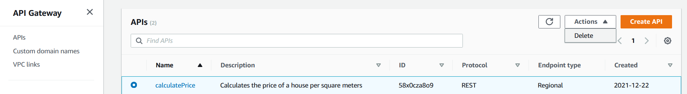
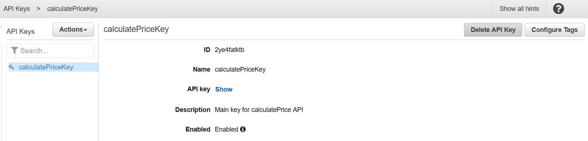
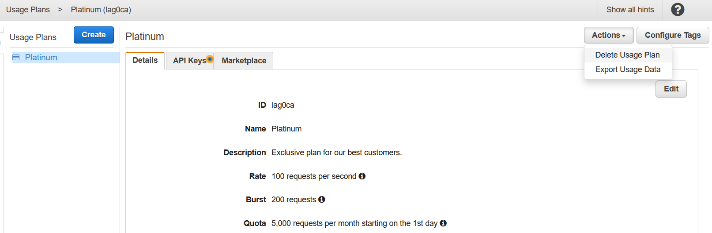
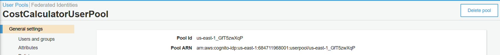
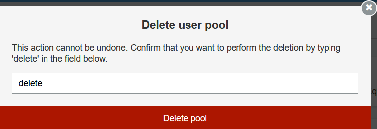
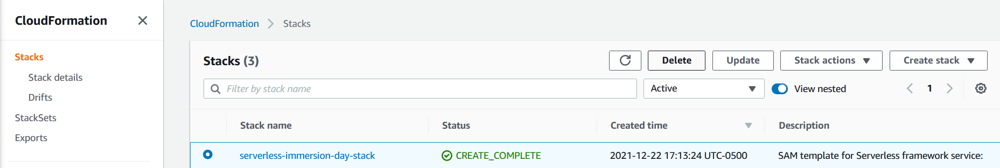

# 리소스 정리

## Cleaning up Your Resources

In Amazon API Gateway Console

1. Select calculatePrice by clicking on the radio button next to it
2. Click Delete from the Actions menu
3. Click Delete in the popup

1. Delete your API Key by going to the following link https://console.aws.amazon.com/apigateway/home?region=us-east-1#/api-keys
2. Select the calculatePriceKey and select Delete API Key
3. Click Delete in the popup

1. Delete your Usage Plan by going to the following link https://console.aws.amazon.com/apigateway/home?region=us-east-1#/usage-plans
2. Select the Platinum plan and select Delete Usage Plan from the Actions menu
3. Click Delete in the popup

In Amazon Cognito Console

1. Click Manage User Pools
2. Click CostCalculatorUserPool
3. Click Delete pool

1. Type delete in popup and Click Delete pool

You may need to refresh the page to see the pool as deleted.

In AWS CloudFormation Console

1. Select serverless-immersion-day-stack
2. Click Delete
3. Click Delete stack in the popup

It will take a few minutes to delete the stack. Click the Refresh icon to validate.

[Previous](8-apigateway.md) | [Next](../../../../30-iam.md)
