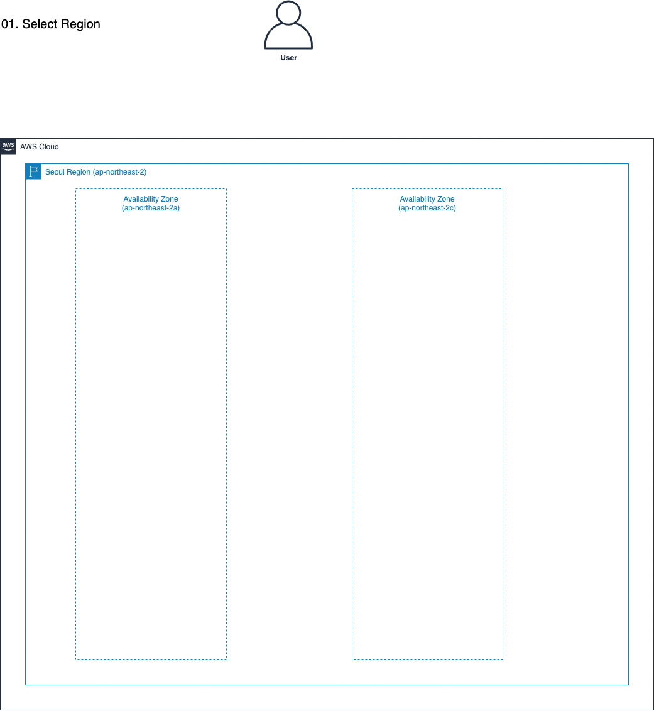

# 심화 모듈 - 웹 애플리케이션

이 워크샵은 AWS를 처음 접하는 사용자들에게 고가용성과 확장성이 보장된 웹 어플리케이션 구축 실습을 아래와 같은 순서로 제공합니다.

## 실습 구성

AWS의 핵심 서비스(VPC, EC2, RDS, S3)를 소개하는 세션과 아래의 아키텍처를 실습을 통해서 직접 구축할 수 있습니다.

## 실습 순서
실습은 아래와 같이 진행합니다.

1. 네트워크 – Amazon VPC

2. 컴퓨트 – Amazon EC2

3. 데이터베이스 – Amazon Aurora

4. 스토리지 – Amazon S3

5. 실습 리소스 정리

모든 실습은 서로 유기적으로 연결되어 있습니다.
따라서 실습은 순서대로 하나씩 차례대로 진행해야 합니다.

[Previous](../README.md) | [Next](./network.md)