# 웹 서버 인스턴스의 시작

이 과정에서는 기본 Amazon Linux 인스턴스를 시작하고, 초기화 과정에서 Apache/PHP Web Server를 자동으로 구성하도록 합니다.

## 인스턴스 생성 및 웹 서비스 접속

1. AWS 콘솔 검색 창에 EC2 를 입력하고 선택합니다. 그리고 좌측 메뉴 상단의 EC2 Dashboard를 클릭합니다. Launch instance 버튼을 누르고, 메뉴에서 Launch instance 를 선택합니다.

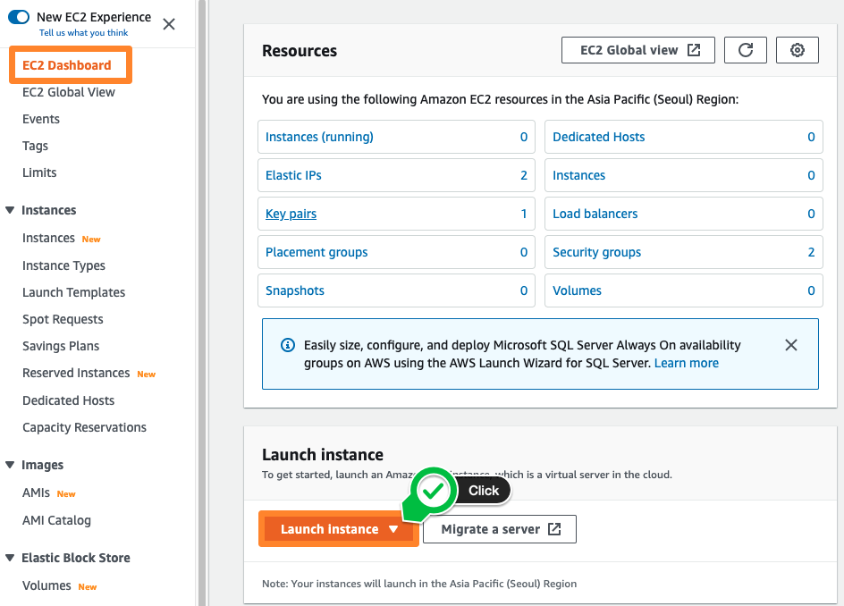

2. [Step 1. Choose AMI] 의 Quick Start 탭에서 Amazon Linux 2 AMI를 선택하십시오.

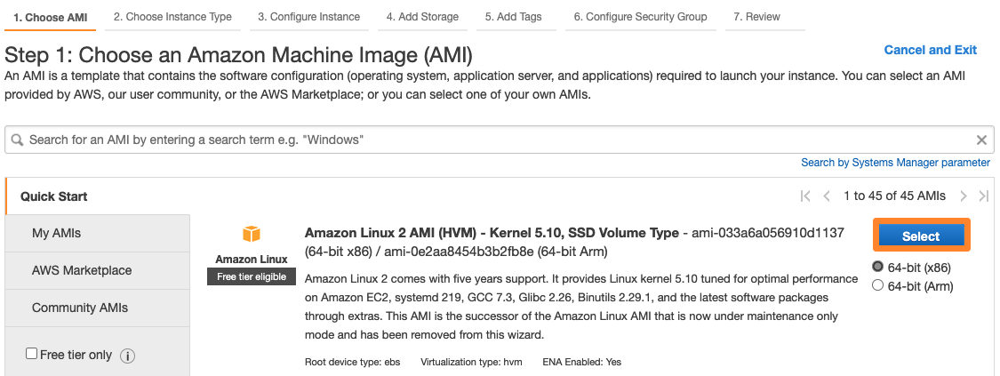

3. [Step 2. Choose Instance Type] 에서 t2.micro를 선택하고 Next: Configure Instacne Details을 클릭하십시오.

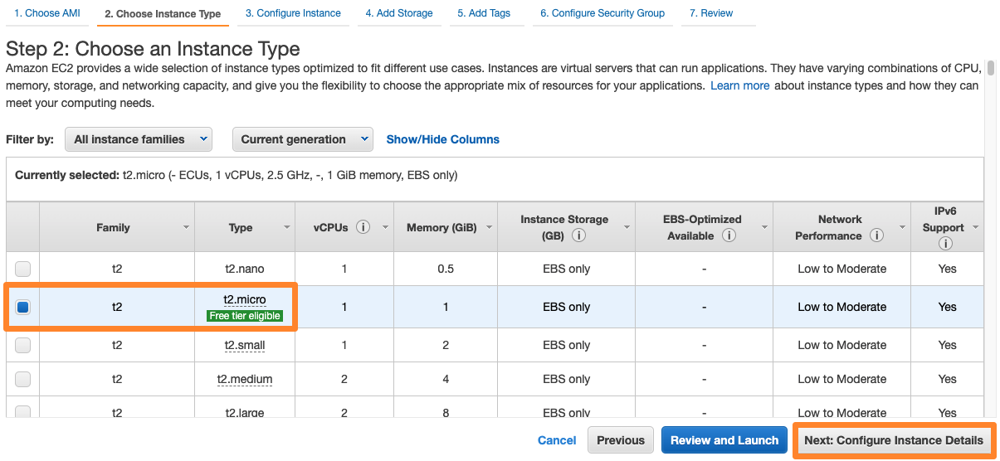

4. [Step 3. Configure Instance] 에서 아래와 같이 설정합니다.

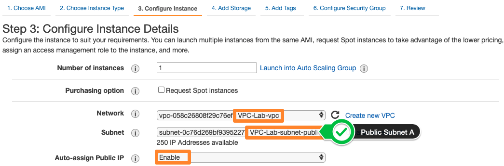

키 | 값
--- | ---
Network | VPC-Lab 태그가 붙어 있는 VPC를 선택합니다.
Subnet | 드롭 다운 메뉴에서 Public subnet A를 찾아 선택합니다.
Auto-assign Public IP | Enable

5. 나머지 모든 값들은 기본값을 사용하고, 화면 하단의 Advanced Details를 클릭하여 확장하십시오. User data 입력란에 아래의 값을 입력 후, Next: Add Storage를 선택 하십시오.

```
#!/bin/sh

# Install a LAMP stack
amazon-linux-extras install -y lamp-mariadb10.2-php7.2 php7.2
yum -y install httpd php-mbstring

# Start the web server
chkconfig httpd on
systemctl start httpd

# Install the web pages for our lab
if [ ! -f /var/www/html/immersion-day-app-php7.tar.gz ]; then
   cd /var/www/html
   wget https://aws-joozero.s3.ap-northeast-2.amazonaws.com/immersion-day-app-php7.tar.gz  
   tar xvfz immersion-day-app-php7.tar.gz
fi

# Install the AWS SDK for PHP
if [ ! -f /var/www/html/aws.zip ]; then
   cd /var/www/html
   mkdir vendor
   cd vendor
   wget https://docs.aws.amazon.com/aws-sdk-php/v3/download/aws.zip
   unzip aws.zip
fi

# Update existing packages
yum -y update
```

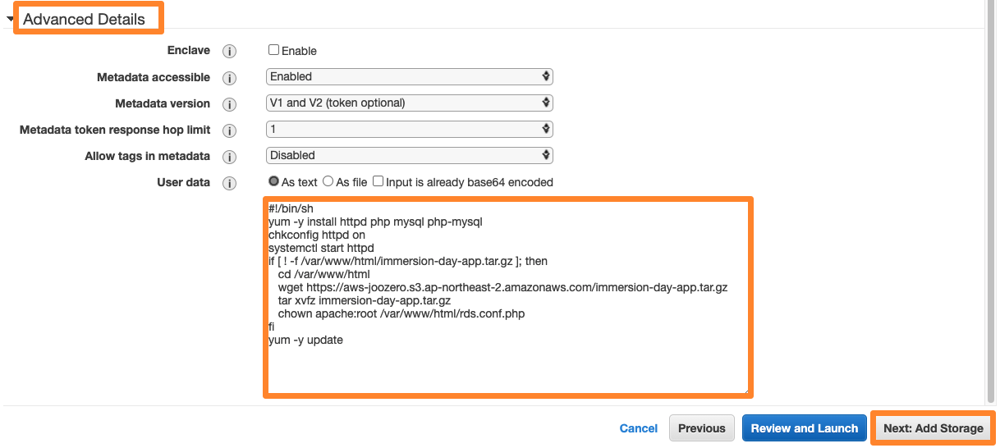

사용자 데이터(User Data)는 최초 인스턴스 생성시 실행되는 사용자 정의 초기화 스크립트 입니다.

6. [Step 4. Add Storage] 에서 인스턴스에 할당하는 OS Volume(EBS Volume)을 정의합니다. 기본 값인 8GB(SSD Type)를 그대로 사용합니다. Next: Add Tags를 클릭하여 다음 단계로 진행합니다.

7. [Step 5: Add Tags] 에서 인스턴스를 식별할 수 있는 다양한 정보를 추가할 수 있습니다. 태그 정보를 통하여 사용자는 인스턴스의 용도, 목적, 비용 관련 정보 등을 손쉽게 확인 할 수 있습니다. Add Tag를 클릭하고, 키와 값을 아래와 같이 입력합니다. 완료되면 Next: Configure Security Group을 클릭하십시오.

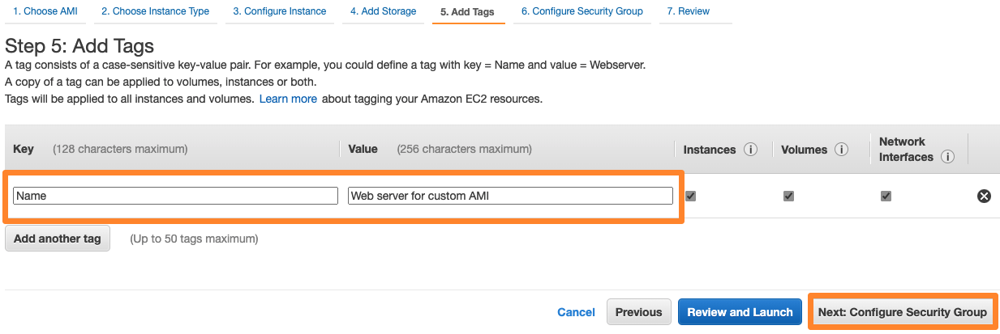

키 | 값
--- | ---
Key | Name
Value | Web server for custom AMI

8. [Step 6: Configure Security Group] 에서는 새로운 보안 그룹을 만들거나 기존에 만들어진 보안 그룹을 선택 할 수 있습니다. 보안 그룹은 방화벽 정책으로 허용하고자 하는 프로토콜과 주소를 지정하게 됩니다. 새로운 보안 그룹을 생성하고 이름을 지정합니다.

Security group name과 Description에 Immersion Day - Web Server 를 입력 후, Add Rule를 선택하여 Type에 HTTP 를 지정하여 Web Service를 위한 TCP/80도 함께 허용합니다. 소스 주소의 0.0.0.0/0은 모든 네트워크에서의 접근을 의미합니다. 우측 하단의 Review and Launch을 클릭합니다.

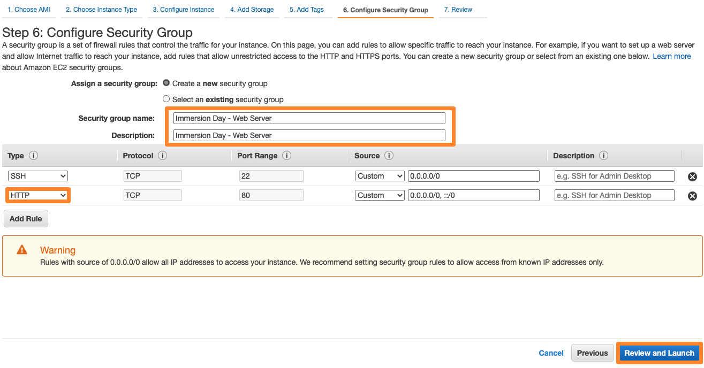

9. [Step 7: Review] 에서 앞서 구성한 정보를 확인하고 Launch을 선택하여 인스턴스를 시작하십시오.

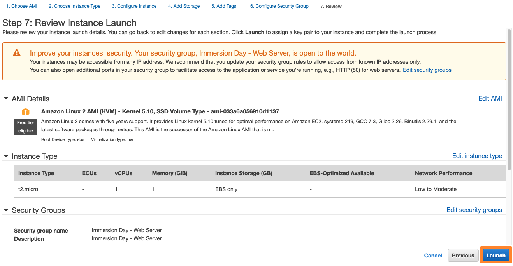

10. 본 실습에서는 키 페어로 인스턴스에 접근하는 방법을 실습하지 않습니다. 따라서 키 페어 선택 화면에서 Proceed without a key pair를 선택합니다. 아래 체크박스를 선택 후, Launch Instances를 클릭합니다.

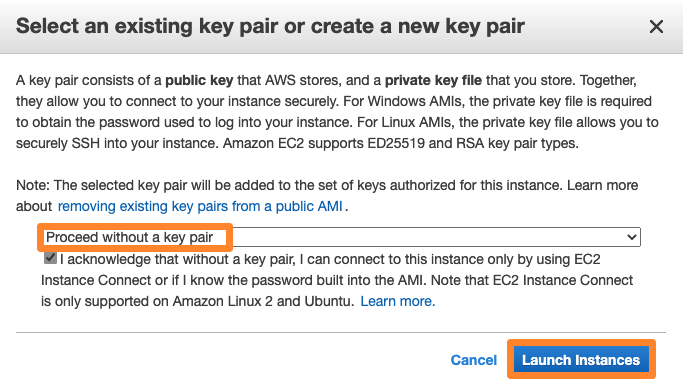

11. 인스턴스 생성이 진행 중이라는 정보가 화면에 표시가 됩니다. 우측 하단의 View Instances(인스턴스 보기) 를 선택하여 EC2 인스턴스의 목록을 확인할 수 있습니다.

12. 인스턴스 구성이 완료되면 인스턴스가 구동되고 있는 가용 영역, 외부에서 접근 가능한 IP 및 DNS 정보를 확인 할 수 있습니다.

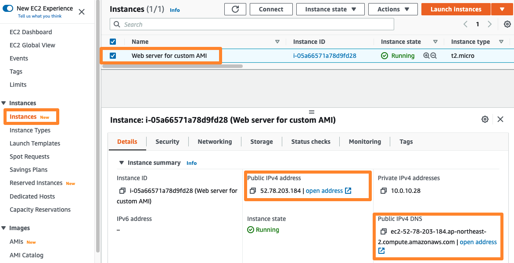

13. 인스턴스의 Instance state 결과가 Running이 될 때까지 대기하십시오. 새로운 웹 브라우저 탭을 열고 URL 주소 입력하는 영역에, EC2 인스턴스의 퍼블릭 DNS 또는 IPv4 퍼블릭 IP를 입력하십시오. 아래와 같이 페이지가 보여지면 웹 서버 인스턴스가 정상적으로 구성된 것입니다.


## 인스턴스 접속

1. EC2 인스턴스 콘솔로 들어갑니다. 접속하고자 하는 인스턴스를 선택한 뒤, 가운데 Connect 버튼을 누릅니다.

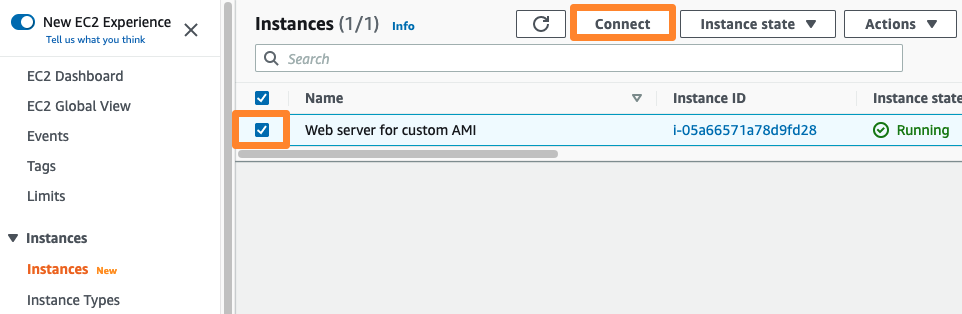

2. Connect your instance 창에서 EC2 Instance Connect 탭을 선택한 뒤, 오른쪽 아래 Connect 버튼을 누릅니다.

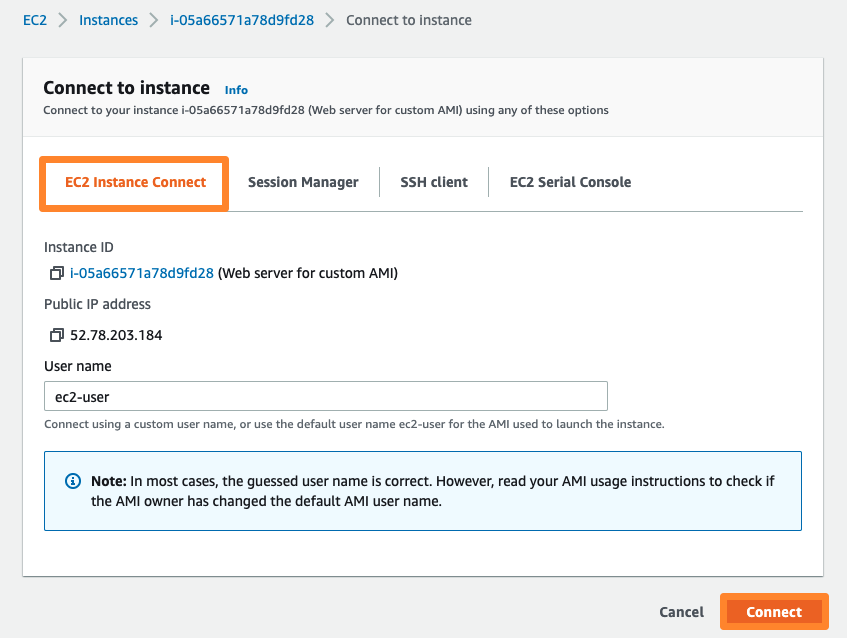

3. 잠시 기다리고 나면, 아래와 같이 브라우저 기반 SSH 콘솔을 사용하실 수 있습니다. CLI 테스트 후 창을 닫으면 됩니다.

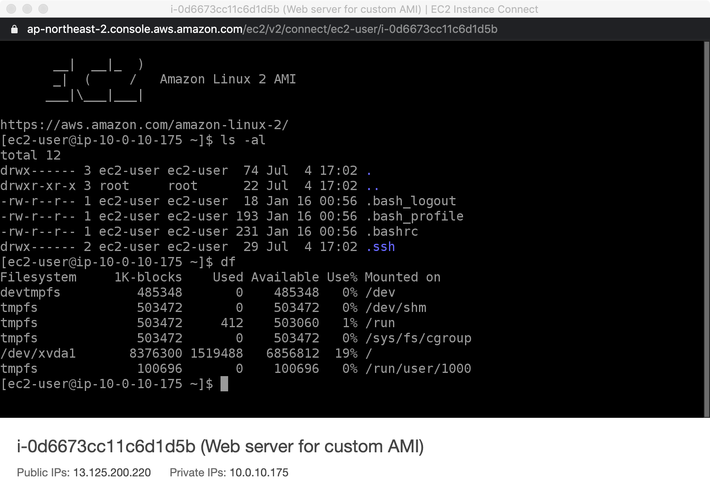

## Session Manager를 사용하여 리눅스 인스턴스에 접속
이어질 데이터베이스 실습에서 웹 서버에 부여된 IAM Role을 사용하여 RDS에 접속합니다. 이에 Session Manager를 사용하여 리눅스 인스턴스에 접근하기를 참고하여 EC2 인스턴스에 IAM Role을 부여합니다.

## 커스텀 AMI 생성
AWS EC2 콘솔에서는 생성된 인스턴스를 이용하여 이미지를 만들고, 추후 인스턴스 생성 시 이 이미지를 사용할 수 있습니다. 이를 커스텀 AMI라고 부릅니다.
여기서는 앞서 생성한 웹 서버 인스턴스를 이용하여 AMI를 만들어 보겠습니다.

1. EC2 콘솔에서 아까 생성한 인스턴스를 선택하고, Actions > Image and templates > Create Image 를 선택합니다.

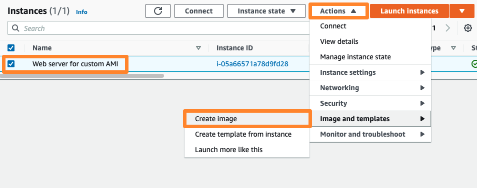

2. Create Image 창에서 아래와 같이 입력하고, Create image를 눌러 이미지를 생성합니다.

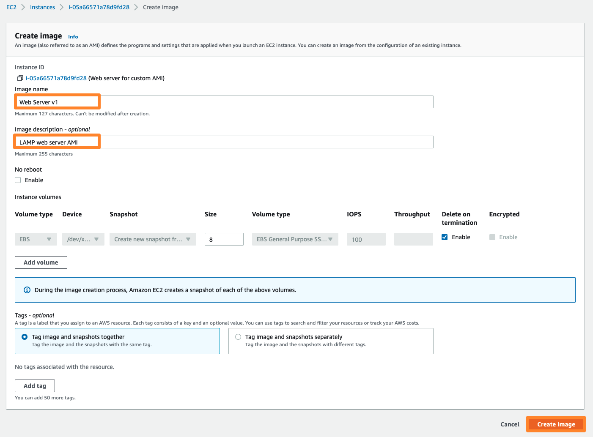

키 | 값
--- | ---
Image name | Web Server v1
Image description | LAMP web server AMI

3. 이미지 생성 요청이 완료되었다는 창을 확인합니다.

4. 좌측 콘솔 메뉴에서 IMAGES 아래 AMIs 버튼을 찾아 클릭합니다. 방금 요청한 AMI의 Status 가 생성 중(Pending) 이거나, 완료되면 사용가능(Available)한 상태인 것을 확인할 수 있습니다.

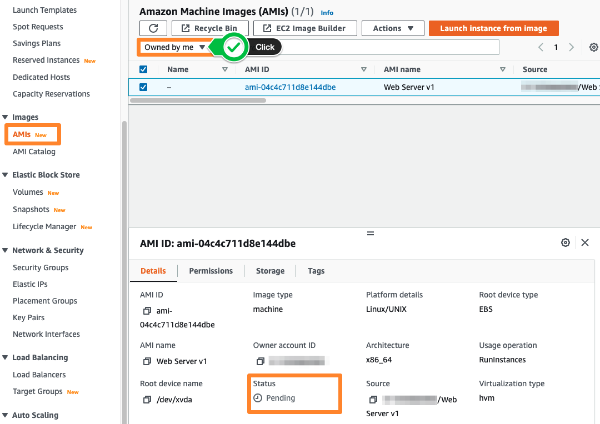

## 인스턴스 종료 (Terminate)
방금 생성한 EC2 인스턴스를 이용하여 오토스케일링에 사용하기 위하여 커스텀 AMI(골든 이미지) 생성을 완료하였습니다. 따라서, 현재 생성한 EC2 인스턴스는 더 이상 필요가 없어 졌으므로, 종료(Termination)해 보도록 하겠습니다. (다음 오토 스케일링 웹 서비스 배포에서 커스텀 AMI를 이용하여 웹 서버를 새로 만들 예정입니다.)

1. EC2 대시보드에서 Instances 탭으로 들어갑니다. 그리고 삭제하고자 하는 인스턴스를 선택합니다. 이후 Instance state -> Terminate instance 를 클릭합니다.

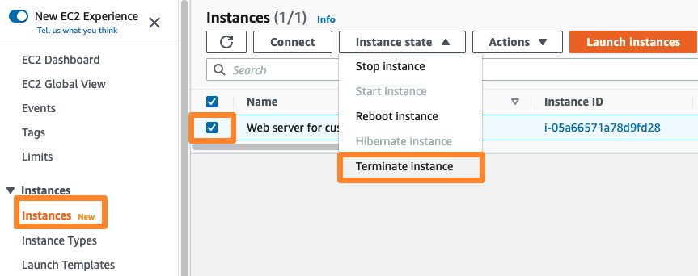

2. 경고 창이 뜨면, 우측 하단의 Terminate를 눌러 삭제합니다.

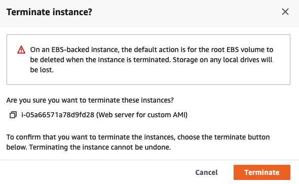

3. Instance State가 Shutting down으로 변경됩니다. 이후 곧 terminated로 변경됩니다. 삭제가 완료되었습니다. 인스턴스 삭제 로깅을 위하여 일정 시간은 보일 수 있습니다.

## 현재까지의 아키텍처 구성
현재까지 구성한 자원들을 개념적으로 도면에 표시해 보면 아래 그림과 같습니다.


[Previous](../compute.md) | [Next](./20-auto-scaling.md)