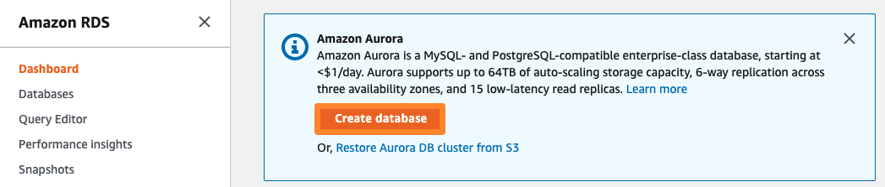
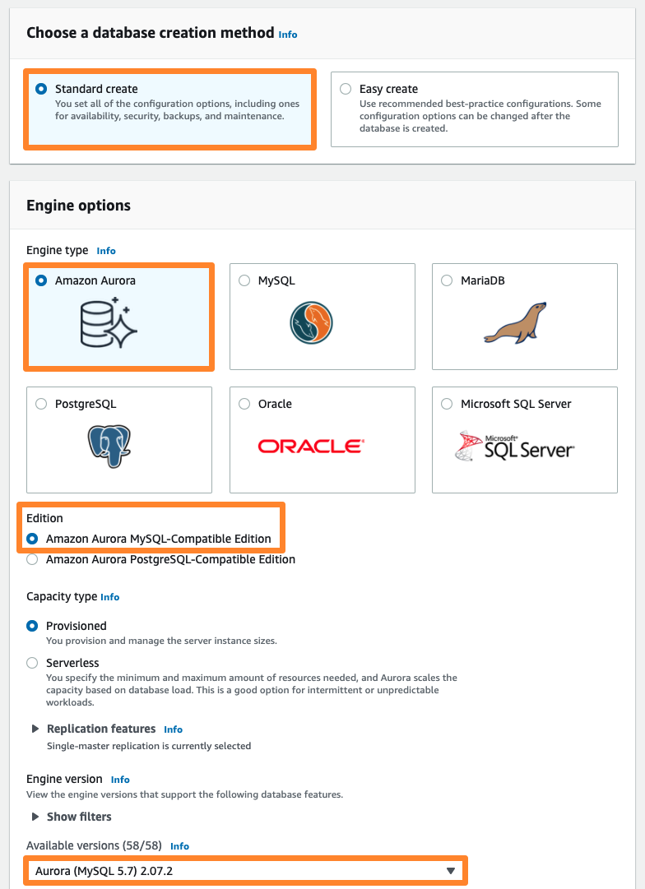

# RDS 인스턴스 생성
RDS에서 사용할 보안 그룹이 생성되었으므로, 이제 RDS Aurora(MySQL 호환) 인스턴스를 생성하겠습니다.

1. AWS Management Console에서 RDS(Relational Database Service) 로 이동하십시오.

2. 대시보드에서 Create Database 를 선택하여 RDS 인스턴스의 생성을 시작합니다.

3. 사용할 RDS 인스턴스의 데이터베이스 엔진을 선택합니다. Amazon RDS에서는 Open Source 기반의 Database 엔진 및 상용 Database 엔진을 선택할 수 있습니다. 본 Lab에서는 Amazon에서 제공하는 MySQL 호환 Database 엔진인 Amazon Aurora 를 사용하겠습니다. 데이터베이스 생성 방식 선택 란에서 Standard Create 을 선택합니다. Engine options 를 Amazon Aurora 로, Edition 은 Amazon Aurora with MySQL compatibility 를 선택하고, Version 은 Aurora (MySQL 5.7) 2.07.2 를 선택합니다.

4. Templates 에서 Production 을 선택합니다. Settings 항목에서는 RDS 인스턴스의 식별을 위한 정보 및 관리자 정보를 지정합니다. 아래의 정보를 입력하세요.

키 | 값
--- | ---
DB cluster identifier | rdscluster
Master username | awsuser
Master password | awspassword

5. DB instance size 와 Availability & durability 항목이 아래와 같은지 확인합니다. 메모리 최적화 인스턴스 클래스와 다른 가용 영역에 읽기 전용 복제 노드를 구성 하는 것이 기본값으로 설정되어 있습니다.

6. Connectivity 란에서 네트워크 및 보안을 설정합니다. Virtual private cloud (VPC) 란에 앞서 생성한 VPC-Lab을 선택하고, RDS 인스턴스가 운영될 VPC, 서브넷, VPC 외부로부터의 접근 허용여부 및 보안 그룹을 지정합니다. 아래의 내용대로 설정하시면 됩니다.

키 | 값
--- | ---
Virtual private cloud (VPC) | VPC-Lab-vpc
Subnet group | Create new DB subnet group
Publicly accessible | No
VPC security group | Choose existing: DB-SG (Default의 경우 옆의 X표를 클릭하여 삭제)
데이터베이스 포트 (Database Port) | 3306

7. 아래로 스크롤을 내려, Additional configuration 을 클릭합니다. 아래와 같이 데이터베이스 옵션을 설정합니다.

키 | 값
--- | ---
Initial database name | immersionday
DB cluster parameter group | default.aurora5.7
DB parameter group | default.aurora5.7

8. 이후 항목인 Backup, Encryption, Backtrack, Monitoring, Log exports 등 항목은 모두 기본값을 그대로 사용하고, Create database 를 눌러 Database를 생성합니다.

이제 새로운 RDS 인스턴스가 생성됩니다. 이 작업은 5분이상 소요될 수 있습니다. DB 인스턴스의 상태가 Available 이 되면 RDS 인스턴스를 사용할 수 있습니다.

## 현재까지의 아키텍처 구성
현재까지 구성한 자원들을 개념적으로 도면에 표시해 보면 아래 그림과 같습니다.

[Previous](./create-sg.md) | [Next](./connect-app.md)