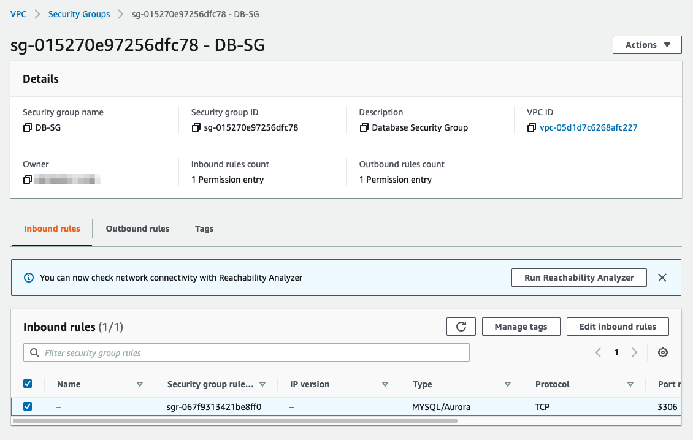

# VPC 보안 그룹 생성
RDS 서비스는 EC2와 동일한 보안 모델을 사용합니다. 가장 일반적인 사용 형식은 동일한 VPC 내에서 어플리케이션 서버로서 운영 중인 EC2 인스턴스에 데이터베이스 서버로서 데이터를 제공하거나, VPC 외부에 있는 DB 어플리케이션 Client에게 접근이 가능하도록 구성하는 것입니다. 적절한 접근 통제를 위하여 VPC 보안 그룹(Security Group)을 활용해야 합니다.

앞선 [컴퓨트 – Amazon EC2](https://catalog.workshops.aws/general-immersionday/ko-KR/advanced-modules/compute) 실습에서 Launch Template과 Auto Scaling 그룹을 이용하여 웹 서버 EC2 인스턴스들을 생성해 보았습니다. 이 인스턴스들에는 Launch Template을 이용하여 보안 그룹 ASG-Web-Inst-SG 를 적용해 둔 상태입니다. 이 정보들을 이용하여, Auto Scaling 그룹 내의 웹 서버 인스턴스들만 RDS 인스턴스에 접속할 수 있도록 보안 그룹을 생성하겠습니다.

1. VPC 대시보드  좌측에서 Security Groups를 선택 후 Create Security Group을 선택하십시오.

2. 아래와 같이 Security group name, Description 을 입력하고, 해당 그룹을 사용할 VPC 를 지정합니다. (VPC-Lab 태깅된 VPC 지정 확인)

키 | 값
--- | ---
Security group name | DB-SG
Descripyion | Database Security Group
VPC | VPC-Lab-vpc

3. 스크롤을 내려 Inbound rules란으로 이동합니다. Add rule을 눌러 앞서 Auto Scaling 그룹을 통해 생성한 EC2 Web Server들에서 RDS로의 접근을 허용하는 보안 그룹 정책을 생성합니다. Type 에서 MySQL/Aurora(3306) 을 선택합니다. 프로토콜과 포트 범위가 자동으로 지정됩니다. Source 항목에는 접근을 허용할 IP 대역(CIDR) 또는 접근할 EC2 인스턴스들이 사용하고 있는 다른 보안 그룹을 지정할 수 있습니다. 컴퓨트 – Amazon EC2 실습의 Auto Scaling Group의 Web Instance들에 적용되어 있는 보안 그룹( ASG-Web-Inst-SG )을 선택합니다.

4. 지정이 완료되면 가장 하단의 Create Security Group 을 눌러 보안 그룹을 생성합니다. 생성 완료된 보안 그룹을 확인합니다.

[Previous](../database.md) | [Next](./create-rds.md)