# 웹앱 서버와 RDS 연결
Secret을 생성했다면 이제는 웹 서버에 해당 secret을 사용할 수 있도록 권한을 부여해야 합니다. 이를 수행하기 위해 웹 서버가 secret을 읽을 수 있는 Policy를 생성해야 합니다. 웹 서버 실습에서 부여한 Role에 해당 policy를 추가합니다.

## 웹 서버가 secret에 접근할 수 있도록 허용하기

1. AWS 관리 콘솔에 로그인한 후, IAM 콘솔  창을 엽니다. 왼쪽 사이드 바에서 Policies를 선택하고 Create Policy를 클릭합니다.

2. Choose a service를 클릭합니다.

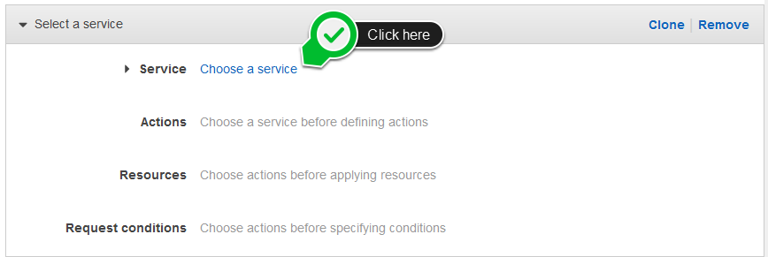

3. Secrets Manager를 검색 바에 입력합니다. Secrets Manager를 클릭합니다.

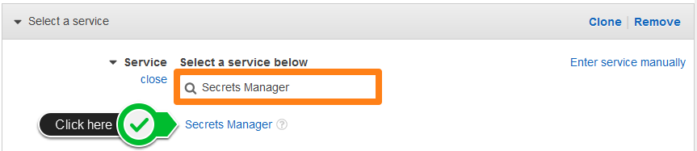

4. Access level 아래에 Read 옆 세모를 누르고 GetSecretValue를 클릭합니다.

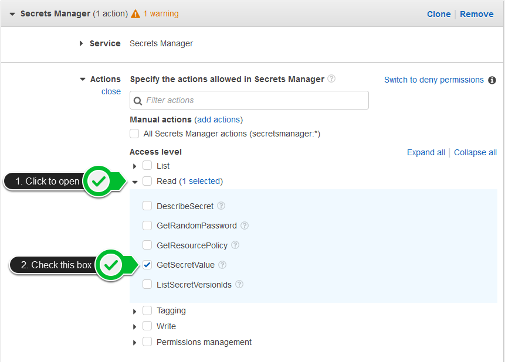

5. Resources 옆 세모를 누릅니다. 본 실습에서는 All resources를 선택하고 Next: Tags를 클릭합니다.

본 실습에서는 EC2가 모든 secret에 접근할 수 있도록 설정했습니다. 하지만 실제 도입시에는 특정 secret만 읽을 수 있도록 설정하는 메카니즘을 고려해야 합니다.

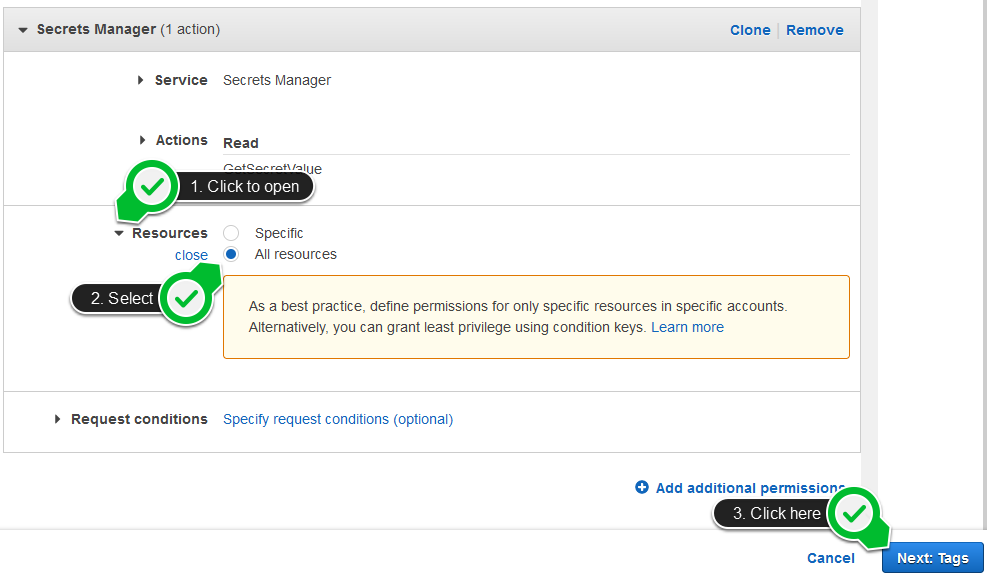

6. Next: Review를 클릭합니다.

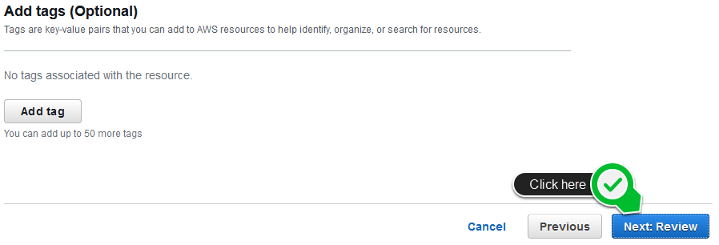

7. Review Policy 화면에서 새로운 policy 이름을 ReadSecrets로 부여하고 Create policy를 클릭합니다.

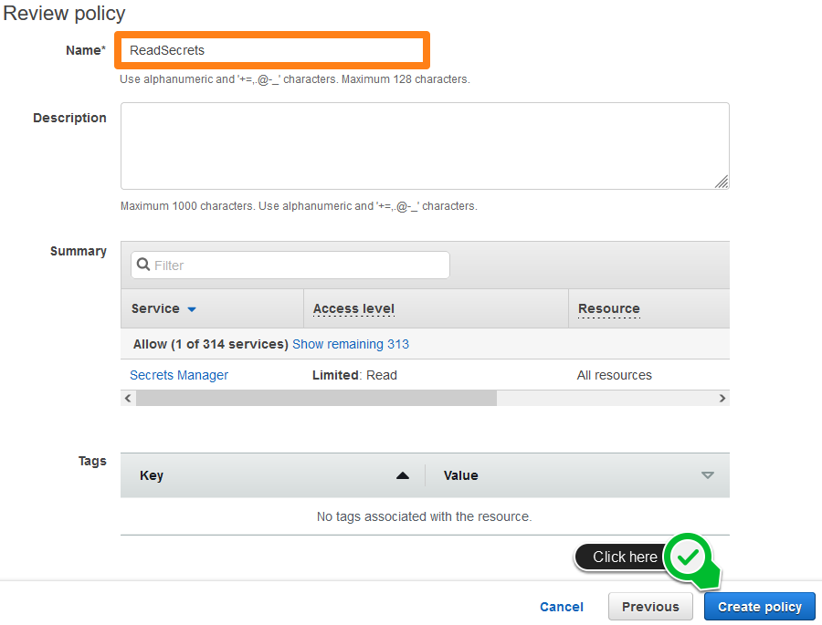

8. 왼쪽 메뉴 탭에서 Roles을 선택하고 검색 창에서 SSMInstanceProfile를 입력합니다. 해당 role의 경우 [Session Manager를 사용하여 리눅스 인스턴스에 접근하기](../../1.basic-modules/10-ec2/ec2-linux/3-ec2-1)에서 생성한 role입니다. SSMInstanceProfile를 클릭합니다.

9. Permissions policies 아래에 Attach policies를 클릭합니다.

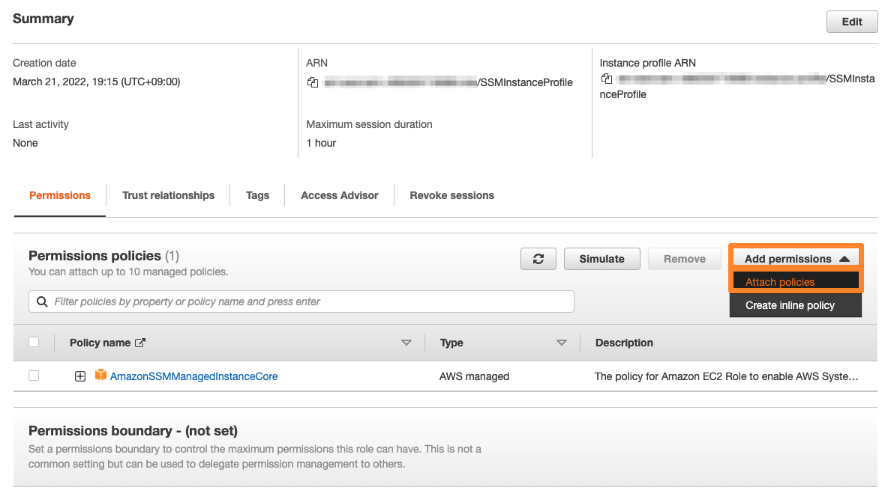

10. ReadSecrets로 생성한 policy를 찾고 Attach policy를 클릭합니다.

11. Permissions policies 아래에 AmazonSSMManagedInstanceCore와 ReadSecrets가 리스트에 있는지 확인합니다.

## 주소록에 접근하기

1. [EC2 콘솔창](https://console.aws.amazon.com/ec2/v2/home?instanceState=running)에 접근하고 load balancer를 클릭합니다. 컴퓨트 실습에서 생성한 로드밸런서의 DNS 이름을 복사한 후, 브라우저에서 새 탭을 열고 붙여넣습니다.

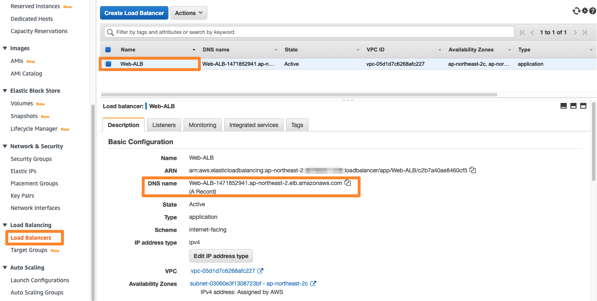

2. 웹 서버에 접속한 후, RDS 탭으로 들어갑니다.

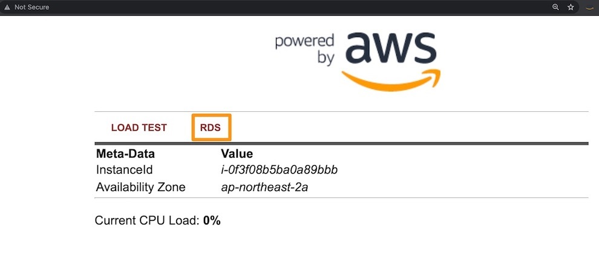

3. 이제 여러분이 생성한 데이터베이스에 있는 데이터들을 확인할 수 있습니다.

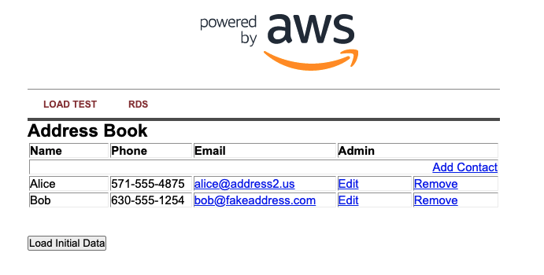

이것은 AWS에 의해 관리되는 MySQL 데이터베이스와 상호 작용하는 매우 기본적인 실습입니다. RDS는 훨씬 더 복잡한 관계형 데이터베이스 시나리오를 지원할 수 있지만 이 간단한 예로 요점을 충분히 이해할 수 있길 바랍니다. 주소록에 있는 Add Contact, Edit 및 Remove 링크를 사용하여 RDS 데이터베이스에서 콘텐츠를 자유롭게 추가/편집/삭제할 수 있습니다.

## 현재까지의 아키텍처 구성
자, 여기까지의 작업을 통해 여러분은 고가용성이 보장된 웹 서비스를 구축하였습니다. 지금까지 구성한 인프라 아키텍처는 아래와 같습니다.


[Previous](./connect-app.md) | [Next](./manage-rds.md)
