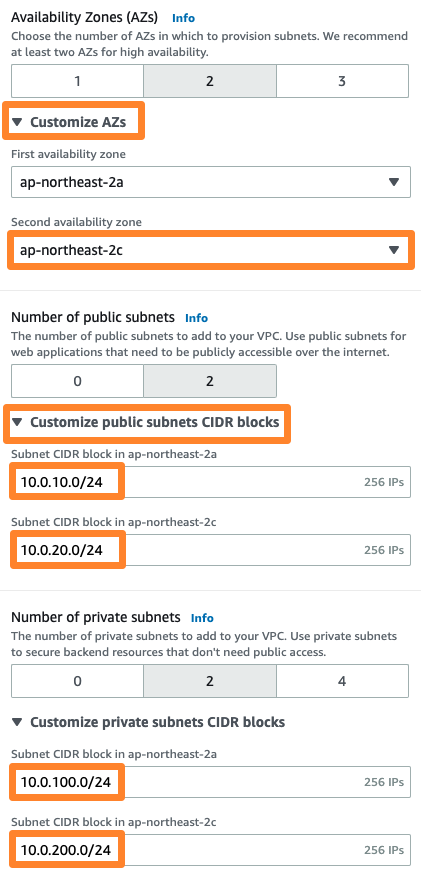

# VPC 생성
Amazon Virtual Private Cloud(Amazon VPC)에서는 사용자가 정의한 가상 네트워크로 AWS 리소스를 시작할 수 있습니다.
이 가상 네트워크는 AWS의 확장 가능한 인프라를 사용한다는 이점과 함께 고객의 자체 데이터 센터에서 운영하는 기존 네트워크와 매우 유사합니다.

## VPC 서비스로 이동

1. AWS Management Console 에 로그인 후, Service 메뉴에서 VPC 를 선택합니다.

만약, 아래 스크린샷과 보시고 계신 화면이 다를 경우, 좌측 위 New VPC Experience 토글을 활성화 합니다.

## 탄력적 IP 생성
1. VPC Dashboard 좌측 메뉴에서 Elastic IPs(탄력적 IP) 를 클릭합니다.

2. Allocate Elastic IP Address(새 주소 할당) 을 클릭 합니다. 이것은 VPC Wizard를 통하여 생성할 NAT Gateway에 할당하기 위하여 미리 생성하는 것입니다.

3. 탄력적 IP(Elastic IP)는 사용자 계정(Account)에 고정적으로 할당되며, 인스턴스의 상태에 관계 없이 지속적으로 할당되는 IP를 의미하며, Public IP이므로 외부에서 접근이 가능한 IP입니다. NAT Gateway에 사용할 고정된 Public IP를 생성하기 위하여 우측 하단의 Allocate(할당) 을 클릭합니다.

4. 사용자 계정(Account)에 할당된 새로운 탄력적 IP(Elastic IP)를 확인 할 수 있습니다.

## VPC 마법사를 이용한 VPC 생성

1. VPC Dashboard(대시보드) 를 선택하고, Launch VPC Wizard(VPC 마법사 시작) 을 클릭하여 VPC 생성 마법사를 시작합니다.

2. 본 실습에 사용되는 자원들을 프로비저닝할 공간을 생성하기 위해, VPC와 Subnet을 생성할겁니다. Resource to create은 **VPC, subnets, etc.**를 선택하고 태그 이름은 VPC-Lab으로 변경합니다. IPv4 CIDR block은 기본 설정을 그대로 둡니다.

3. 고가용성을 고려한 아키텍처를 설계하기 위해 서브넷을 생성할 공간을 2로 두고 Customize AZs에서 가용 영역은 2a와 2c를 선택합니다. 그리고 인터넷과 직접적으로 통신이 가능한 퍼블릭 서브넷의 CIDR 값은 각각 아래의 화면과 같이 설정합니다. 프라이빗 서브넷의 CIDR 값도 화면과 같이 설정합니다.

KEY | VALUE
--- | ----
2a Public subnet’s IPv4 CIDR | 10.0.10.0/24
2c Public subnet’s IPv4 CIDR | 10.0.20.0/24
2a Private subnet’s IPv4 CIDR | 10.0.100.0/24
2c Private subnet’s IPv4 CIDR | 10.0.200.0/24

4. 프라이빗 서브넷의 인스턴스가 VPC 외부의 서비스에 연결할 수 있지만 외부 서비스에서 이러한 인스턴스와의 직접적인 연결을 시작할 수 없도록 NAT 게이트웨이를 사용할 수 있습니다. 본 실습에서는 비용 절감 차원에서 하나의 가용 영역에만 NAT 게이트웨이를 생성합니다. 또한, DNS 옵션의 경우, DNS hostnames와 DNS resolution을 둘다 활성화합니다. 설정 값을 확인 후, Create VPC 버튼을 클릭합니다.

5. VPC가 생성되면서 아래 화면과 같이 네트워크 관련 리소스들이 생성되는 프로세스를 확인할 수 있습니다.

6. 생성된 VPC의 정보를 확인할 수 있습니다. CIDR 값, route table, network ACL 등 관련 정보를 확인합니다.

## 현재까지의 아키텍처 구성

VPC 마법사를 통해서 VPC가 완성 되었다면, 현재까지 구성된 환경은 아래와 같습니다.

[Previous](../network.md) | [Next](./20-index.md)