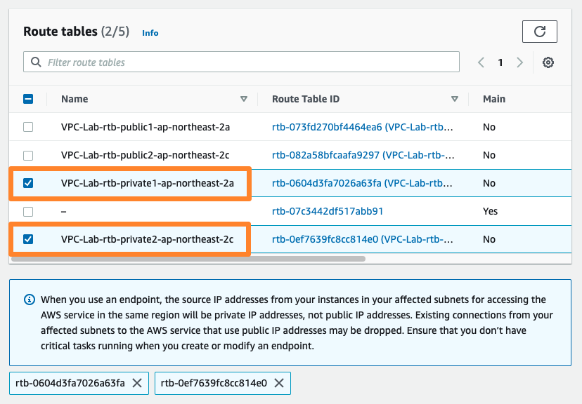

# (옵션) VPC 엔드포인트

이 단원에서는 VPC 엔드포인트를 학습하기 위해 S3용 엔드포인트를 생성합니다. 이 단계를 수행하지 않아도 다음 실습을 진행하는 데에 영향은 없습니다.

## VPC 엔드 포인트

1. VPC 대시보드에서 엔드포인트를 선택하십시오. 엔드포인트 생성을 클릭합니다.

2. 이름은 화면과 같이 s3 endpoint로 작성한 후, 어떤 서비스를 위한 게이트웨이를 생성할 것인지 선택하는 옵션에서 AWS services를 클릭합니다. 아래의 검색 창에서 s3를 입력하고, 가장 위에 있는 목록을 선택합니다.

3. S3 VPC 엔드 포인트의 경우, gateway 타입과 interface 타입이 있습니다. 본 실습에서는 gateway 타입을 선택합니다. 그리고 배포할 위치는 본 실습에서 생성한 VPC-Lab-vpc를 선택합니다.

4. 엔드포인트를 반영할 라우팅 테이블을 선택합니다. 선택된 라우팅 테이블에는 엔드포인트를 사용하기 위한 별도의 라우팅 정보가 자동으로 추가됩니다.

5. 아래와 같이 엔드포인트에 대한 접근 통제를 위한 정책을 구성할 수도 있습니다.

VPC 엔드 포인트 정책을 이용해 AWS 서비스에 대해 ​​전체 액세스를 허용하거나 사용자 지정(Custom) 정책을 만들 수 있습니다. VPC 엔드 포인트 정책 에 대해 자세히 알아보세요.

6. 앞서 지정한 프라이빗 라우팅 테이블에 게이트웨이 엔드포인트를 통해 Amazon S3로 접근하기 위한 라우팅이 자동으로 추가되었음을 확인합니다.

VPC 엔드포인트는 AWS 네트워크 내부 통신이며 엔드포인트를 통한 트래픽을 제어할 수 있다는 보안 및 컴플라이언스상 이점이 있습니다. 또한 NAT 게이트웨이가 아닌 VPC 엔드포인트를 통해 데이터를 전송할 경우 데이터 처리 비용을 최적화할 수 있습니다.

[Previous](./10-index.md) | [Next](./30-index.md)