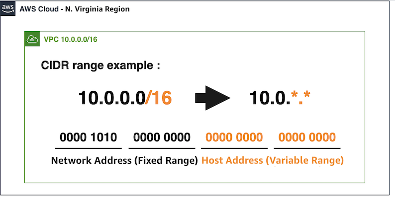

# 부록 - 추가적인 VPC 개념들

## CIDR 주소 범위 이해하기
CIDR(Classless Inter-Domain Routing)은 네트워크의 주소와 크기를 표현하는 방식 중 하나입니다. 위의 실습에서 생성한 VPC는 16을 서브넷 값으로 하는 IP 주소 범위입니다. 각 자원에 줄 수 있는 IP 갯수는 2의 16승인 65,536개입니다.

VPC CIDR 블록을 지정할 때, 허용된 블록 크기는 /16 넷 마스크 (사용 가능한 IP 주소 65,536개)~ /28 넷 마스크(사용 가능한 IP 주소 16개)입니다. 각 서브넷 CIDR 블록에서 첫 4개의 IP 주소와 마지막 IP 주소는 사용자가 사용할 수 없으므로 인스턴스에 할당할 수 없습니다. 예를 들어 10.0.0.0/24 CIDR 블록의 서브넷에서는 다음 5개 IP 주소가 예약되어 있습니다.

키 | 값
--- | ---
10.0.0.0 | 네트워크 주소
10.0.0.1 | AWS에서 VPC 라우터용으로 예약
10.0.0.2 | DNS 서버 주소
10.0.0.3 | AWS에서 나중에 사용하려고 예약
10.0.0.255 | 네트워크 브로드캐스트 주소

[Previous](./20-index.md) | [Next](./compute.md)