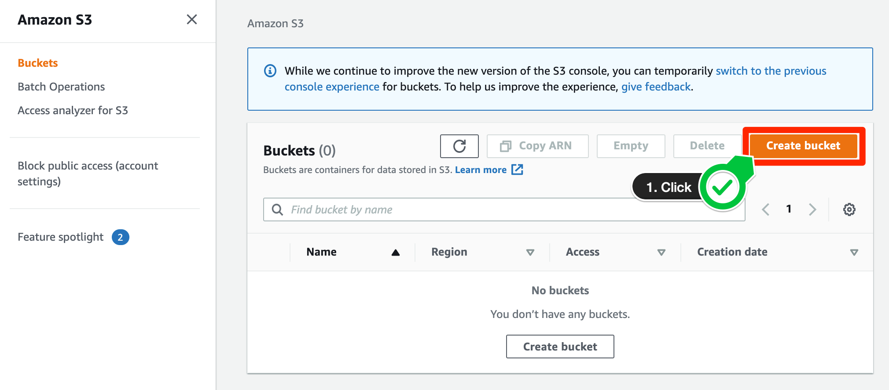
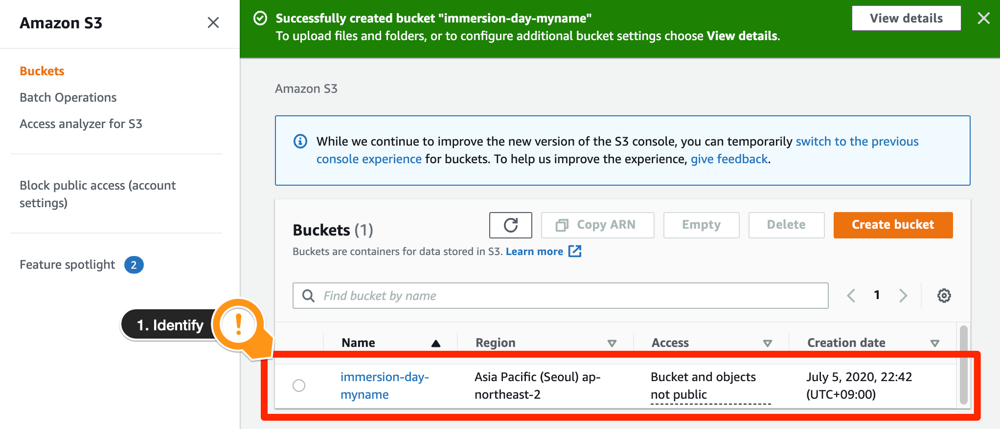

# S3에 Bucket 생성
Amazon S3의 모든 오브젝트(Object)는 버킷(Bucket)내에 저장됩니다. Amazon S3에 데이터를 저장하기 전에 반드시 Bucket을 생성해야 합니다.

## 버킷 생성

1. AWS Management Console에서 S3 서비스  로 접속한 다음 Create bucket을 눌러 버킷을 생성합니다.

2. Bucket name 필드에 고유한 버킷 이름을 입력하십시오. 본 실습에서는 immersion-day-실습사용자이름 으로 입력하여 진행합니다. 입력한 버킷 이름은 Amazon S3내에서 중복될 수 없고 유일 해야 합니다. 조직 이름 또는 사용자 이름 등을 반영하여 유일한 버킷 이름을 생성하십시오. Region 드롭-다운 박스에서 버킷을 생성할 리전을 지정하십시오. 본 실습에서는 Asia Pacific (Seoul) 을 선택합니다. Object Ownership은 ACLs enabled로 변경합니다. Bucket settings for Block Public Access는 기본 값을 유지하고, 우측 하단의 Create bucket를 선택하십시오.

버킷 이름은 아래의 규칙을 반드시 준수해야 합니다.

- 소문자, 숫자, 점(.) 그리고 대쉬(-)를 포함 할 수 있습니다.

- 반드시 숫자 또는 문자로 시작해야 합니다.

- 최소 3자에서 최대 255문자의 길이로 지정이 가능합니다.

- IP주소와 같은 형식으로 지정할 수 없습니다. (e.g., 265.255.5.4)

버킷이 생성되는 리전에 따라 추가적인 제약이 있을 수 있습니다. 버킷의 이름은 한 번 생성하면 변경이 불가능 하며, 버킷 내에 저장된 오브젝트를 지정하기 위하여 URL에 포함됩니다. 생성할 버킷의 이름이 적절한지 확인하시기 바랍니다.

3. Amazon S3에 버킷이 생성되었습니다.

Bucket을 생성하는 것만으로는 비용이 과금 되지 않습니다. Bucket에 Object를 저장하거나 Object를 Bucket으로 전송하거나 외부로 전송하는 것에 대해서만 비용이 과금됩니다.

[Previous](../database.md) | [Next]()