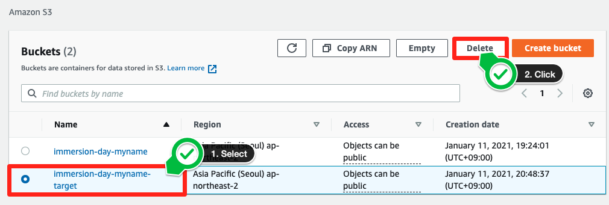
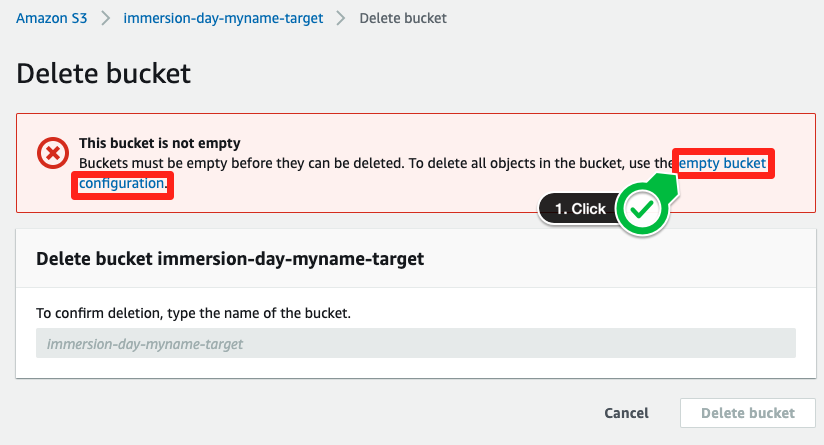
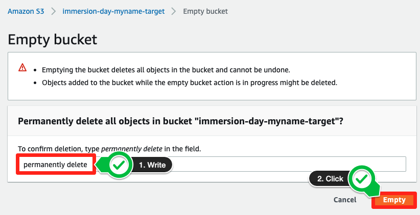
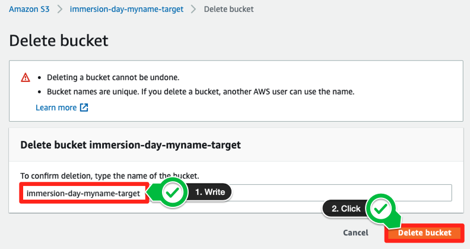

# 오브젝트 및 버킷 삭제

불필요한 비용을 막기 위하여 불필요한 오브젝트 및 버킷을 삭제할 수 있습니다.

1. Amazon S3 Console에서 삭제하고자 하는 버킷을 선택하고, Delete를 클릭하십시오. 삭제를 위한 대화 상자가 나타납니다.

2. 빈 버킷이 아니여서 버킷을 삭제할 수 없다는 경고문이 나옵니다. empty bucket configuration 을 선택하여 버킷을 비우는 작업을 수행합니다.

3. Empty bucket을 통해, 버킷 내의 모든 오브젝트를 한번에 삭제하는 작업을 수행합니다. permanently delete를 작성한 다음 Empty 버튼을 클릭합니다.

4. 위의 작업으로 빈 버킷을 만들었다면 1번 작업을 다시 수행합니다. 버킷 이름을 입력하고 Delete bucket 버튼을 누릅니다.

모든 실습을 완료하였습니다. 수고하셨습니다.

[Previous](./enable-versioning.md) | [Next](../cleanup.md)