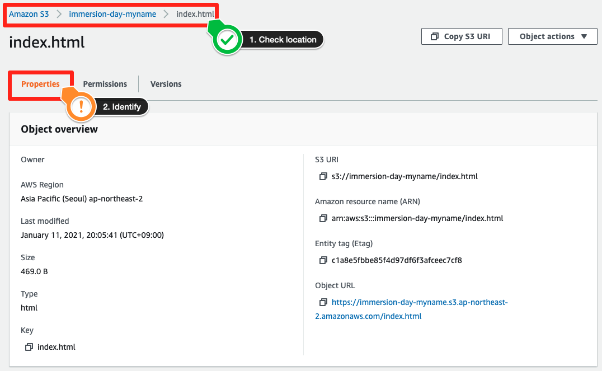
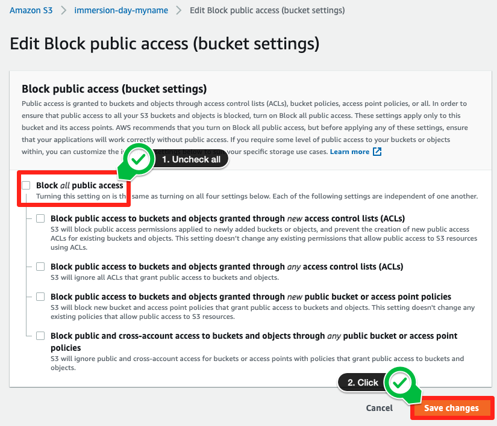
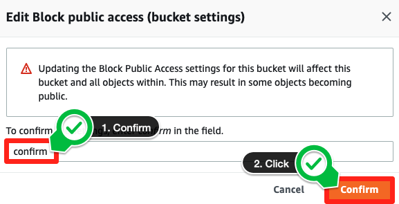
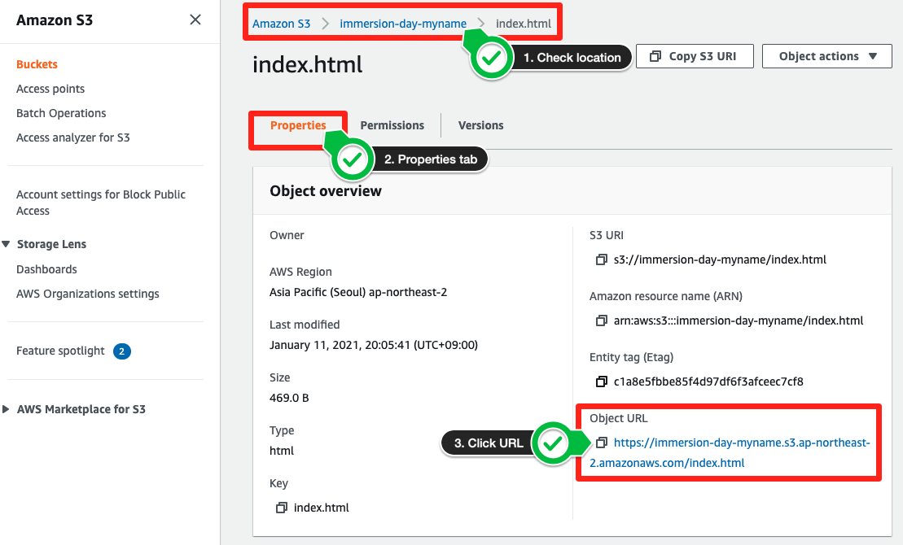
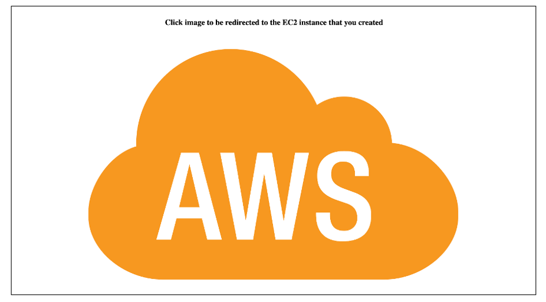
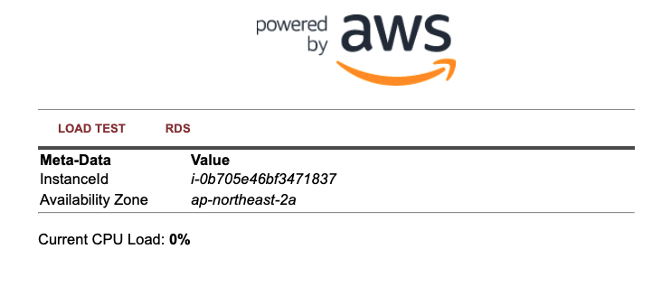

# 오브젝트 보기

버킷에 오브젝트를 추가하였으면, 이제 웹 브라우저에서 해당 오브젝트를 확인해 보겠습니다.

## 오브젝트 보기

1. Amazon S3 Console에서 확인하고자 하는 오브젝트를 클릭 하십시오. 아래와 같이 오브젝트에 대한 상세 정보를 확인 할 수 있습니다.

기본적으로 S3 버킷에 있는 모든 오브젝트는 소유자 전용입니다(Private).
https://{Bucket}.s3.{region}.amazonaws.com/{Object} 와 같은 형식의 URL을 통해 해당 오브젝트를 확인하기 위해서는 외부사용자가 읽을 수 있도록 읽기 권한을 부여해야 합니다. 또는 해당 오브젝트에 대하여 인증 정보가 포함된 시그니처 기반의 Signed URL을 생성하여, 권한이 없는 사용자가 임시적으로 해당 오브젝트에 접근하게 할 수 있습니다.

2. 다시 이전 페이지로 돌아가 버킷의 Permissions 탭을 선택합니다. Block public access (bucket settings) 의 적용 여부를 수정하기 위해, 오른쪽 Edit 버튼을 누릅니다.

3. 맨 위 체크박스를 선택 해제 하고 Save changes 버튼을 누르세요.

4. 버킷의 퍼블릭 액세스 차단 편집 팝업 창에서 confirm 을 입력하시고 Confirm 버튼을 누르세요.

5. Objects 탭을 클릭하고, 업로드한 파일들을 선택 한 후 Action 드롭 다운 버튼을 클릭하고, Make public 버튼을 눌러서 퍼블릭으로 설정합니다.

6. 확인 창이 팝업되면 다시 Make public 버튼을 눌러 확인해줍니다.

7. 버킷 페이지로 다시 돌아와 index.html을 선택하고, 세부 정보 표시 항목에서 Object URL 링크를 클릭합니다.

8. HTML 오브젝트 파일 객체 URL에 접속 하시면 아래와 같은 화면이 출력됩니다.

9. 이미지를 클릭 시, 생성한 인스턴스 페이지로 리다이렉트 됩니다.

[Previous](./put-object.md) | [Next](./static-web-hosting.md)
